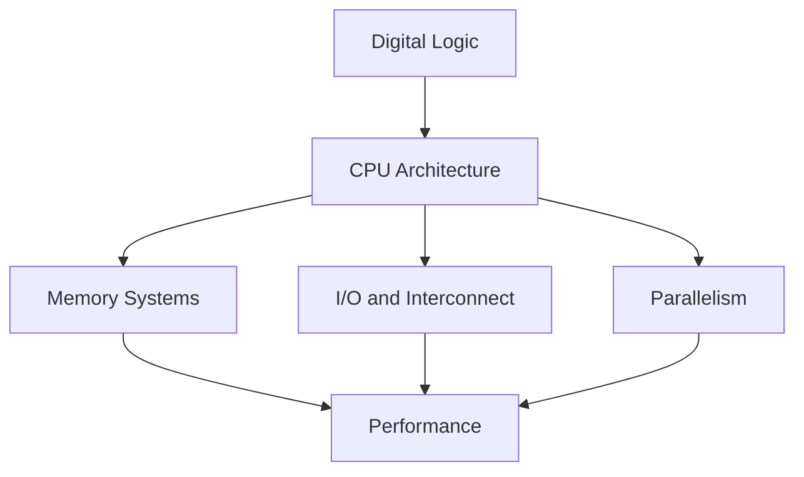

# Computer Architecture — Map of Content

This is the entry point into the vault. Everything is cross-linked with `[[wikilinks]]`; use Obsidian's **Graph View** to see the whole map, or jump in through the sections below.

> [!tip] How to use this vault
> - Start at the top and work down — later notes assume earlier concepts.
> - Every note has a **Summary** callout at the top and **See also** links at the bottom.
> - Diagrams live in `attachments/` as SVG and are embedded inline — open them directly if you want to zoom/edit.

## 1 — Fundamentals (digital logic)
- [[Number Systems and Data Representation]]
- [[Boolean Algebra and Logic Gates]]
- [[Combinational Logic Circuits]]
- [[Sequential Logic Circuits]]

## 2 — CPU Architecture
- [[Von Neumann vs Harvard Architecture]]
- [[Instruction Set Architecture]]
- [[CPU Datapath and Control Unit]]
- [[Addressing Modes]]
- [[Pipelining]]
- [[Pipeline Hazards]]
- [[Superscalar and Out-of-Order Execution]]

## 3 — Memory Systems
- [[Memory Hierarchy]]
- [[Cache Memory]]
- [[Virtual Memory]]
- [[Memory Technologies]]

## 4 — I/O and Interconnect
- [[Bus Architecture]]
- [[IO Systems and Interrupts]]

## 5 — Parallelism
- [[Flynns Taxonomy]]
- [[Multicore and Multiprocessing]]
- [[GPU Architecture]]

## 6 — Performance
- [[Performance Metrics]]
- [[Amdahls Law]]

## Reference
- [[Glossary]]

---

## Conceptual roadmap

## Big picture: how it all fits together

A computer executes programs by repeatedly fetching instructions from **memory** (see [[Memory Hierarchy]]), decoding them according to an **[[Instruction Set Architecture]]**, and executing them on a **[[CPU Datapath and Control Unit|datapath]]** built from the digital logic in [[Boolean Algebra and Logic Gates]], [[Combinational Logic Circuits]], and [[Sequential Logic Circuits]]. Modern CPUs overlap this work using [[Pipelining]] and exploit even more parallelism via [[Superscalar and Out-of-Order Execution]], [[Multicore and Multiprocessing]], and specialized [[GPU Architecture|GPUs]]. All of this is tied together by a [[Bus Architecture|bus]] or interconnect and coordinated through [[IO Systems and Interrupts]]. We evaluate the result with [[Performance Metrics]] and laws such as [[Amdahls Law]].

#moc
