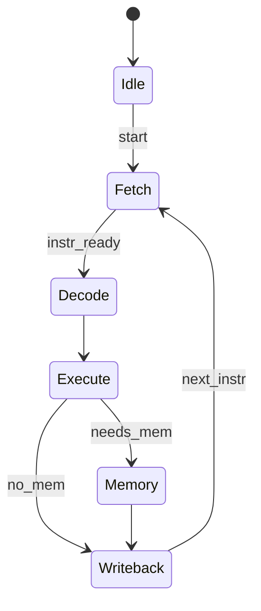

# Sequential Logic Circuits

> [!summary] Summary
> Unlike combinational logic, sequential circuits have **memory** — their output depends on current inputs *and* past state. Latches, flip-flops, registers, and finite state machines built from them are what let a CPU actually hold a program counter, registers, and pipeline state between clock cycles.

## 1. Latches vs flip-flops

- A **latch** is *level-triggered*: transparent (output follows input) whenever the enable/clock signal is high (or low).
- A **flip-flop** is *edge-triggered*: it samples input only at a clock edge (rising or falling), holding its value otherwise.

CPUs almost exclusively use edge-triggered flip-flops because level-sensitive latches can create unpredictable race conditions when chained (multiple stages become transparent simultaneously).

### SR latch (set-reset)
Built from two cross-coupled NOR (or NAND) gates.

```
  S ──┐
       [NOR]──┬── Q
   ┌──────────┘
   └──[NOR]────── Q'
  R ──┘
```
- S=1,R=0 → Q=1 (set)
- S=0,R=1 → Q=0 (reset)
- S=0,R=0 → holds previous state
- S=1,R=1 → invalid/undefined (both outputs try to go 0)

### D latch / D flip-flop
Adds a single Data input, eliminating the invalid state. The **D flip-flop** samples D on the clock edge and holds it until the next edge — this is the standard building block for registers.

```
   D ──►[D Flip-Flop]──► Q
   CLK ──►(edge-triggered)
```

### JK flip-flop
Fixes the SR latch's invalid state: J=K=1 causes the output to **toggle** instead of being undefined. Used in counters.

### T flip-flop
Toggles output every clock edge when T=1 — the natural building block for binary counters.

## 2. Registers

A **register** is simply a bank of D flip-flops sharing a clock, storing an n-bit word. Registers form:
- The CPU's **register file** (general-purpose registers, see [[CPU Datapath and Control Unit]])
- The **Program Counter (PC)**, **Instruction Register (IR)**, **Memory Address/Data Registers (MAR/MDR)**
- **Pipeline latches** between pipeline stages (see [[Pipelining]])

## 3. Counters

- **Ripple (asynchronous) counter**: each flip-flop's clock is driven by the previous stage's output — simple, but delay accumulates ("ripples") through stages.
- **Synchronous counter**: all flip-flops share the same clock; combinational logic determines each next state, avoiding ripple delay — used whenever timing matters (e.g., PC increment logic).

## 4. Finite State Machines (FSMs)

An FSM = combinational logic (next-state + output functions) + a register holding current state. Two standard models:

- **Moore machine**: output depends only on current state.
- **Mealy machine**: output depends on current state *and* current input (can react faster, one cycle earlier, but is more prone to glitches).



> [!example] The Control Unit as an FSM
> A classic multi-cycle CPU's [[CPU Datapath and Control Unit|control unit]] is literally implemented as an FSM: each state corresponds to a phase of instruction execution (fetch, decode, execute, memory, writeback), with transitions driven by the opcode and by which resources the instruction needs.

## 5. Setup time, hold time, and clock frequency

For a flip-flop to sample correctly:
- **Setup time** ($t_{su}$): input must be stable *before* the clock edge.
- **Hold time** ($t_h$): input must remain stable *after* the clock edge.

The maximum clock frequency of a synchronous circuit is bounded by:

$$ T_{clk} \geq t_{clk\text{-}to\text{-}Q} + t_{combinational} + t_{su} $$

i.e., clock period must be long enough for a signal to leave one flip-flop, pass through the combinational logic between stages (the *critical path*, see [[Combinational Logic Circuits]]), and satisfy the next flip-flop's setup time. This equation is exactly why [[Pipelining]] increases clock frequency: shortening the combinational logic per stage shortens the minimum clock period.

## See also
- [[Combinational Logic Circuits]] — the logic between sequential elements
- [[CPU Datapath and Control Unit]] — registers and FSM control in a real CPU
- [[Pipelining]] — pipeline registers between stages

#fundamentals #digital-logic #sequential-logic
