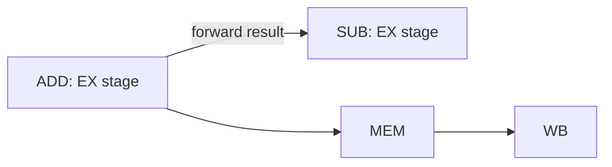

# Pipeline Hazards

> [!summary] Summary
> A hazard is any situation that prevents the next instruction from executing in its designated clock cycle in a pipeline. The three categories are **structural**, **data**, and **control** hazards — each with its own detection and mitigation techniques.

## 1. Structural hazards

Two instructions in the pipeline need the **same hardware resource** at the same time — e.g., a single unified memory port needed simultaneously by an instruction's fetch (IF) and another instruction's memory access (MEM).

**Fix:** duplicate the resource. This is exactly why real CPUs use split L1 instruction/data caches (a Harvard-style split, see [[Von Neumann vs Harvard Architecture]]) — it eliminates the IF/MEM structural hazard entirely.

## 2. Data hazards

An instruction depends on the result of one still in the pipeline.

```
ADD R1, R2, R3      ; R1 not ready until WB
SUB R4, R1, R5       ; needs R1 — but R1 hasn't been written yet!
```

| Type | Condition | 
|---|---|
| RAW (Read After Write) | true dependency — the only one that requires real handling | 
| WAR (Write After Read) | anti-dependency — only an issue in out-of-order execution | 
| WAW (Write After Write) | output dependency — only an issue in out-of-order execution | 

### Fix 1: Forwarding / bypassing
Route the ALU's result directly from the EX/MEM or MEM/WB pipeline register back into the EX stage's input mux, instead of waiting for it to be written to and re-read from the register file.



Forwarding resolves most RAW hazards without stalling, *except* when the dependent instruction is a **load** immediately followed by a use — the data isn't available until after MEM, one stage later than a normal ALU result.

### Fix 2: Stalling (pipeline bubble)
When forwarding can't resolve the hazard in time (the classic **load-use hazard**), the pipeline **stalls** — freezes the dependent instruction and everything behind it for one cycle, inserting a "bubble" (a no-op) into the stage ahead.

```
LOAD R1, 0(R2)      IF ID EX MEM WB
ADD  R3, R1, R4         IF ID ** EX MEM WB     (** = stall bubble waiting for R1 from MEM)
```

### Fix 3: Compiler instruction scheduling
The compiler reorders independent instructions to fill the delay slot after a load, hiding the stall without any hardware bubble — a classic RISC-compiler co-design technique.

## 3. Control hazards

Caused by branches: the pipeline doesn't know the next instruction to fetch until the branch is resolved (typically in EX or even later).

### Fix 1: Stall until resolved
Simple but wastes cycles equal to the pipeline depth up to the branch-resolution stage.

### Fix 2: Predict (branch prediction)
Guess the branch outcome and speculatively fetch/execute down that path; if wrong, flush the pipeline and restart from the correct target.

- **Static prediction**: fixed rule, e.g., "always predict not-taken" or "backward branches (loops) taken, forward branches not taken."
- **Dynamic prediction**: hardware predictors that learn from history.
  - **1-bit predictor**: remembers only the last outcome — mispredicts twice at loop boundaries.
  - **2-bit saturating counter**: needs two consecutive mispredictions to flip the prediction — much more stable for loops.
  - **Branch Target Buffer (BTB)**: caches the target address of recently taken branches so the next fetch address is known immediately, without waiting to decode the branch.
  - **Correlating / two-level / TAGE predictors**: use global or per-branch history patterns for high accuracy (modern CPUs exceed 95%+ prediction accuracy).

> [!warning] Misprediction penalty
> The cost of a misprediction equals the number of pipeline stages between fetch and branch resolution — the deeper the pipeline, the higher the flush cost (see [[Pipelining]] §3 on the Pentium 4's 20+ stage pipeline).

### Fix 3: Delayed branch
The instruction immediately after a branch (the "delay slot") always executes regardless of the branch outcome; the compiler fills it with useful, safe work. Common in early RISC ISAs (MIPS); less common in modern deep pipelines where one delay slot isn't enough to hide the latency.

### Fix 4: Predication
Convert a short conditional branch into unconditional execution of *both* paths with a predicate that nullifies the wrong one's effects — avoids the branch (and its misprediction risk) entirely for short if-then blocks.

## 4. Hazard summary table

| Hazard | Cause | Primary fix |
|---|---|---|
| Structural | Resource conflict | Duplicate hardware (split caches, extra ALU ports) |
| Data (RAW) | True dependency | Forwarding; stall only for load-use |
| Data (WAR/WAW) | Register reuse (OoO only) | Register renaming (see [[Superscalar and Out-of-Order Execution]]) |
| Control | Branch outcome unknown | Branch prediction + speculative execution |

## See also
- [[Pipelining]]
- [[Superscalar and Out-of-Order Execution]]
- [[Performance Metrics]]

#cpu #pipelining #hazards
