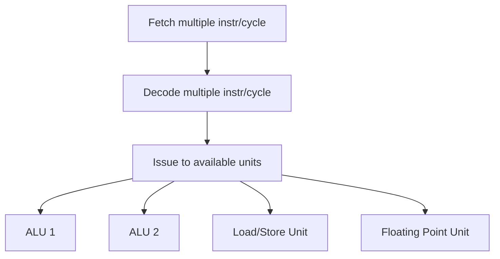
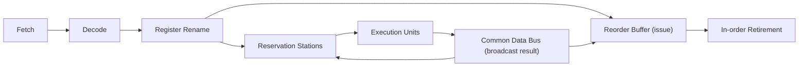

# Superscalar and Out-of-Order Execution

> [!summary] Summary
> Beyond simple pipelining (one instruction issued per cycle), modern high-performance CPUs issue **multiple** instructions per cycle (superscalar) and execute them **out of program order** as soon as their operands are ready — dramatically increasing Instruction-Level Parallelism (ILP) at the cost of substantial hardware complexity.

## 1. Superscalar execution

A **superscalar** CPU has multiple parallel execution units (e.g., 2 ALUs, 1 load/store unit, 1 branch unit, 1 FPU) and can fetch/decode/issue more than one instruction per clock cycle.

This requires **superscalar issue logic** to check dependencies between simultaneously-decoded instructions and route each to a free, appropriate execution unit — much more complex than the single-issue scalar pipeline in [[Pipelining]].

## 2. Out-of-order (OoO) execution

In-order pipelines stall the *entire* pipeline behind any instruction waiting on a hazard (see [[Pipeline Hazards]]), even if later, independent instructions are ready to run. Out-of-order execution lets independent instructions execute as soon as their inputs are ready, regardless of program order, then **retires** (commits) results in original program order to preserve correct architectural behavior.

### Tomasulo's algorithm (conceptual pipeline)

Key structures:
- **Register renaming**: maps architectural registers to a larger pool of physical registers, eliminating WAR and WAW hazards (see [[Pipeline Hazards]]) by giving each write a fresh physical register.
- **Reservation stations**: buffer instructions waiting for operands; once all operands are available, the instruction can issue to an execution unit regardless of program order.
- **Common Data Bus (CDB)**: broadcasts completed results to all reservation stations waiting on that value, enabling forwarding without going through the register file.
- **Reorder Buffer (ROB)**: tracks instructions in original program order so results can be **retired (committed)** in order — essential for precise exceptions and correct handling of speculative/mispredicted instructions (their ROB entries are simply discarded).

## 3. Speculative execution

Combined with [[Pipeline Hazards|branch prediction]], OoO CPUs execute instructions **speculatively** past a predicted branch before it's confirmed correct. If the prediction is right, huge amounts of work are already done; if wrong, the ROB allows a clean flush of all speculative (not-yet-retired) instructions.

> [!warning] Speculative execution and security
> Speculatively executed instructions can leave observable side effects (e.g., in cache state) even when their results are architecturally discarded. This is the root cause of side-channel vulnerabilities like **Spectre** and **Meltdown** — the CPU speculatively accessed data it shouldn't have, and although the *result* was discarded, the *cache footprint* it left behind was measurable.

## 4. Limits to ILP

Even aggressive OoO superscalar CPUs hit diminishing returns:
- **True data dependencies** (RAW chains) fundamentally limit how much can run in parallel regardless of hardware resources.
- **Branch misprediction** wastes speculative work and pipeline slots.
- **Memory latency** — a cache miss can stall dependent instructions for hundreds of cycles even with OoO scheduling around it.
- Diminishing returns and power/complexity costs are a major reason the industry pivoted toward **multiple simpler cores** rather than ever-wider single cores — see [[Multicore and Multiprocessing]].

## 5. VLIW as the alternative philosophy

Instead of *hardware* discovering ILP at runtime (superscalar OoO), **VLIW (Very Long Instruction Word)** designs push that job to the *compiler*, which packs independent operations into wide fixed instruction bundles ahead of time (see [[Instruction Set Architecture]] §5). This trades hardware complexity for compiler complexity and works well when control flow is predictable (DSPs, GPUs' underlying execution units) but struggles with irregular, data-dependent control flow typical of general-purpose code.

## See also
- [[Pipelining]]
- [[Pipeline Hazards]]
- [[Multicore and Multiprocessing]]
- [[Performance Metrics]]

#cpu #superscalar #out-of-order
