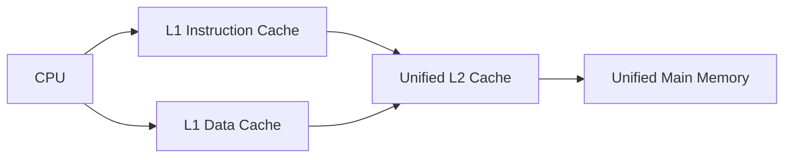

# Von Neumann vs Harvard Architecture

> [!summary] Summary
> These are the two fundamental blueprints for how a CPU connects to memory. Von Neumann uses one unified memory and bus for both instructions and data; Harvard uses physically separate instruction and data memories/buses. Almost every real system today is a hybrid.

## Von Neumann architecture

![[von-neumann-architecture.svg]]

Proposed by John von Neumann (1945, the *EDVAC report*). Core idea: **programs and data share the same memory space** and the same bus.

**Advantages:**
- Simpler hardware — one memory system, one bus.
- Flexible: code can be treated as data (self-modifying code, JIT compilation, loading programs from disk into the same RAM used for data).

**Disadvantage — the von Neumann bottleneck:**
Because instructions and data share one bus, the CPU cannot fetch an instruction and read/write data in the same cycle. This shared-bus contention caps throughput and is a primary motivation for [[Cache Memory|caches]] and [[Pipelining]] (which needs simultaneous instruction fetch and data access — solved in practice with *split* L1 instruction/data caches, a small Harvard-style island inside an otherwise von Neumann machine).

## Harvard architecture

![[harvard-architecture.svg]]

Named after the Harvard Mark I. Core idea: **separate memories and buses for instructions and data**, allowing simultaneous instruction fetch and data access.

**Advantages:**
- No shared-bus bottleneck — instruction fetch and data access happen in parallel, essential for efficient [[Pipelining]].
- Instruction and data memories can have different widths/timings, optimized independently — common in DSPs and microcontrollers.

**Disadvantage:**
- More complex, more pins/wiring for two independent buses.
- Less flexible: harder to treat code as data (no self-modifying code, harder dynamic loading) — an issue for general-purpose OS-hosted computing but irrelevant for embedded control loops.

## Modified (hybrid) Harvard — what real CPUs actually do

Nearly all modern general-purpose CPUs (x86, ARM, RISC-V) present a **unified von Neumann view** to software (one address space, one main memory) but implement a **split Harvard-style cache** internally:

This gives the parallel-access benefit of Harvard (separate L1-I / L1-D caches feeding the pipeline every cycle) while keeping the programmer-visible simplicity and flexibility of von Neumann (one memory space, self-modifying code still technically possible, just requires cache-coherency flushes). See [[Cache Memory]] and [[Memory Hierarchy]].

## Comparison table

| Aspect | Von Neumann | Harvard | Modified Harvard (real CPUs) |
|---|---|---|---|
| Memory | Unified | Separate I/D | Unified main memory, split L1 caches |
| Buses | Shared | Separate | Separate at cache level only |
| Simultaneous fetch+access | No | Yes | Yes (at cache level) |
| Self-modifying code | Natural | Difficult | Possible with cache flush |
| Typical use | General-purpose CPUs (logically) | DSPs, microcontrollers | x86 / ARM / RISC-V (physically) |

## See also
- [[CPU Datapath and Control Unit]]
- [[Memory Hierarchy]]
- [[Cache Memory]]
- [[Pipelining]]

#cpu #architecture
