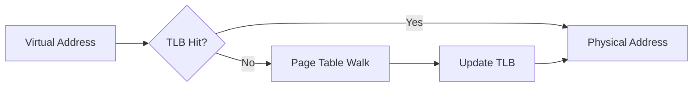

# Virtual Memory

> [!summary] Summary
> Virtual memory gives each process the illusion of a private, contiguous address space, larger than physical RAM, isolated from other processes — implemented via address translation between virtual and physical addresses, backed by hardware (the MMU/TLB) and the OS.

## 1. Why virtual memory

- **Isolation**: one process cannot read/write another's memory — a hardware-enforced security boundary.
- **Simplicity for programmers/compilers**: every process sees the same address layout (e.g., starting at address 0) regardless of physical placement or what else is running.
- **Overcommit**: a process's virtual address space can exceed physical RAM, with the OS paging less-used data out to disk/SSD (extending the [[Memory Hierarchy]] down to storage).
- **Efficient sharing**: shared libraries can map the same physical pages into multiple processes' virtual spaces.

## 2. Paging

Both virtual and physical address spaces are divided into fixed-size **pages** (commonly 4 KB). A **page table** maps virtual page numbers to physical frame numbers.

```
Virtual Address:
| ---- Virtual Page Number ---- | --- Page Offset --- |

                 ↓ page table lookup

Physical Address:
| ---- Physical Frame Number --- | --- Page Offset --- |
```
The **page offset** is unchanged by translation — only the page number is translated, which is why page size determines offset-field width.

### Page table entry (PTE) fields
- Physical frame number
- **Valid bit**: is this page currently mapped to physical memory at all?
- **Protection bits**: read/write/execute permissions (also underlies W^X / DEP security enforcement)
- **Dirty bit**: has the page been modified since loaded (needed to decide whether it must be written back on eviction)?
- **Accessed bit**: used by page-replacement algorithms (e.g., a clock/second-chance approximation of LRU)

### Multi-level page tables
A single flat page table for a 64-bit address space would be absurdly large. Real systems use **multi-level (hierarchical) page tables** — e.g., x86-64 uses 4 (or 5) levels — so that unused regions of the address space cost no table memory at all, only allocating page-table pages for regions actually in use.

## 3. Translation Lookaside Buffer (TLB)

Walking a multi-level page table on *every* memory access would be prohibitively slow. The **TLB** is a small, fast cache (inside the MMU) of recent virtual→physical translations.



A **TLB miss** requires walking the page table (potentially multiple memory accesses for a multi-level table) — much slower than a TLB hit, which is why TLB hit rate is critical to overall performance, similar in spirit to cache hit rate (see [[Cache Memory]]).

## 4. Page faults and demand paging

A **page fault** occurs when the CPU accesses a virtual page whose valid bit is 0 (not currently in physical memory). The OS then:
1. Finds a free physical frame (or evicts one using a page-replacement policy — LRU, clock/second-chance, etc.).
2. Reads the required page in from disk/SSD (the backing store or swap).
3. Updates the page table and retries the faulting instruction.

This is **demand paging**: pages are loaded lazily, only when actually accessed, rather than the whole process being loaded up front.

> [!warning] Thrashing
> If the sum of processes' active working sets exceeds physical RAM, the system may spend more time paging data in and out than doing useful work — throughput collapses. This is why RAM sizing and working-set-aware schedulers matter so much in practice.

## 5. Segmentation (contrast with paging)

An older/alternative scheme: divide the address space into variable-sized logical **segments** (code, stack, heap, etc.) each with its own base+limit. Simpler conceptually but suffers external fragmentation; most modern systems use paging exclusively or a hybrid (x86 historically supported both, though 64-bit mode largely abandoned segmentation for general use).

## 6. Virtual memory and caches together

Since caches (see [[Cache Memory]]) may be indexed/tagged by virtual or physical addresses, systems must handle cases like:
- **PIPT** (Physically Indexed, Physically Tagged): simplest, but needs translation before cache lookup — adds latency.
- **VIPT** (Virtually Indexed, Physically Tagged): the common compromise — index bits taken from the untranslated offset/page-aligned bits so cache lookup and TLB lookup happen in parallel.

## See also
- [[Memory Hierarchy]]
- [[Cache Memory]]
- [[Addressing Modes]] — PC-relative addressing and ASLR

#memory #virtual-memory
