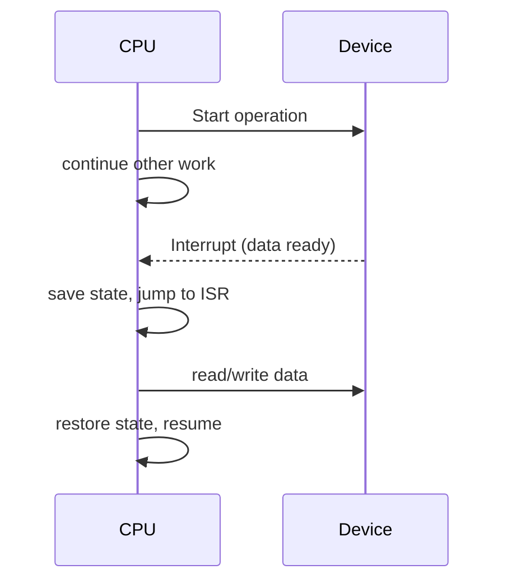
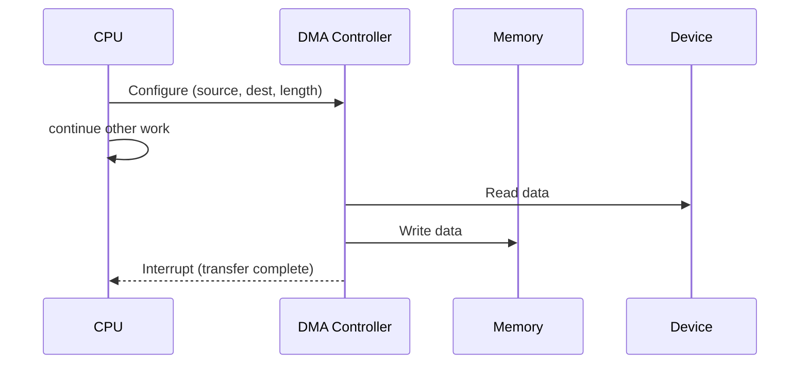

# I/O Systems and Interrupts

> [!summary] Summary
> I/O devices are orders of magnitude slower than the CPU. This note covers the three main strategies for handling that speed mismatch — polling, interrupts, and DMA — and how interrupts/exceptions are handled by the CPU pipeline.

## 1. Programmed I/O: polling

The CPU repeatedly checks (polls) a device status register in a loop until it's ready, then transfers data itself.

```c
while (!(status_reg & READY_BIT)) { /* spin */ }
data = data_reg;
```

Simple, but wastes CPU cycles busy-waiting — fine for very fast or rarely-idle devices, wasteful otherwise.

## 2. Interrupt-driven I/O

The device signals the CPU via a hardware **interrupt line** only when it needs attention, letting the CPU do other useful work in the meantime.



### Handling sequence
1. Device asserts an interrupt request (IRQ) line.
2. CPU finishes its current instruction (interrupts are usually only taken at instruction boundaries), then checks pending interrupts.
3. CPU saves minimal state (PC, flags) — typically onto a stack or dedicated registers.
4. CPU jumps to the appropriate **Interrupt Service Routine (ISR)**, looked up via an **interrupt vector table** indexed by interrupt number.
5. ISR services the device, then executes a return-from-interrupt instruction, restoring saved state.

### Interrupt priority and masking
- Interrupts have priority levels; a higher-priority interrupt can preempt a lower-priority ISR.
- The CPU can **mask** (disable) interrupts during critical sections to guarantee atomicity.
- A **Non-Maskable Interrupt (NMI)** cannot be masked — reserved for catastrophic events (e.g., hardware failure).
- A **priority encoder** (see [[Combinational Logic Circuits]]) resolves which of several simultaneous IRQs is serviced first.

## 3. Exceptions vs interrupts

| | Interrupt | Exception |
|---|---|---|
| Cause | External event (device signal) | Internal event during instruction execution |
| Timing | Asynchronous — can occur any time | Synchronous — tied to a specific instruction |
| Examples | Timer tick, keyboard press, disk ready | Divide-by-zero, page fault (see [[Virtual Memory]]), illegal opcode, system call (`syscall`/`trap`) |

Both are typically handled by the same underlying hardware/OS mechanism (vector table + handler dispatch), which is why they're often grouped together as "traps."

> [!note] Precise exceptions
> A **precise exception** guarantees that all instructions before the faulting one have fully completed, and none after it have had any effect — essential for the OS to correctly resume or recover. This is much harder to guarantee in [[Superscalar and Out-of-Order Execution|out-of-order]] pipelines, which is exactly why the **Reorder Buffer** retires instructions in program order.

## 4. DMA (Direct Memory Access)

For bulk transfers (disk I/O, network packets), having the CPU shuttle every byte through a register (via interrupts or polling) wastes cycles. A **DMA controller** takes over the memory bus and transfers data directly between a device and main memory, interrupting the CPU only once — at the *end* of the whole transfer.



This requires the DMA controller to **arbitrate for the bus** (see [[Bus Architecture]]) against the CPU — a classic structural-hazard-style resource conflict resolved by bus arbitration hardware, sometimes stealing individual bus cycles ("cycle stealing") rather than holding the bus for the entire transfer.

## 5. Cache/DMA coherence

Because DMA writes bypass the CPU's caches, a cache line holding stale data can persist after a DMA write to the same physical memory. Systems handle this either by:
- **Snooping** DMA traffic and invalidating/updating affected cache lines automatically (common on modern coherent platforms), or
- Requiring explicit **cache flush/invalidate** operations by software before/after DMA transfers.

## See also
- [[Bus Architecture]]
- [[Virtual Memory]] — page faults as a form of exception
- [[Superscalar and Out-of-Order Execution]] — precise exceptions

#io #interrupts #dma
