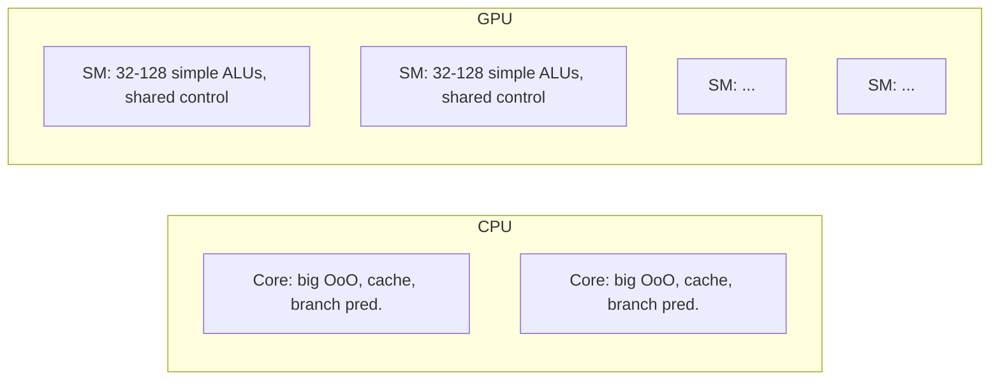

# GPU Architecture

> [!summary] Summary
> GPUs are throughput-oriented processors built around massive data parallelism (see [[Flynns Taxonomy|SIMD/SIMT]]), trading single-thread latency for enormous aggregate throughput on regular, data-parallel workloads — originally graphics, now also general-purpose compute (GPGPU) and machine learning.

## 1. CPU vs GPU design philosophy

| | CPU | GPU |
|---|---|---|
| Optimized for | Low latency on any single thread | High throughput across many threads |
| Core count | Few (4–64), complex | Thousands, simple |
| Control logic per core | Large (branch prediction, OoO — see [[Superscalar and Out-of-Order Execution]]) | Minimal — shared control across groups of cores |
| Cache | Large, multi-level, latency-hiding | Smaller per-thread, relies on massive parallelism + fast context switching to hide latency instead |
| Best workload | Irregular control flow, sequential dependencies | Regular, data-parallel, high arithmetic intensity |

## 2. SIMT: Single Instruction, Multiple Threads

GPUs execute in a model NVIDIA calls **SIMT**, a hybrid of SIMD and multithreading: groups of threads (a **warp** of 32 threads in NVIDIA terminology, a **wavefront** of 64 in AMD terminology) execute the *same instruction* in lockstep across all lanes, but each thread has its own registers and can follow its own data values (though not, cheaply, its own control flow).

### Branch/warp divergence
If threads within a warp take different paths on a conditional branch (`if/else`), the hardware must execute **both** paths sequentially, masking off the inactive threads on each — this is **warp divergence**, and it can silently multiply execution time for branch-heavy code. Writing GPU-friendly code means minimizing divergent branches within a warp.

> [!example] Divergence cost
> If half the threads in a warp take the `if` branch and half take the `else` branch, the warp effectively executes *both* branches serially for all 32 threads (masking the inactive half each time) — up to 2x slower than if all 32 threads agreed on the branch direction.

## 3. Memory hierarchy on GPUs

- **Registers** — per-thread, very fast, limited (register pressure limits how many threads can run concurrently per SM).
- **Shared memory / L1** — fast, explicitly programmer-managed on-chip memory shared by threads within the same block/workgroup — used as a manual cache for data reused across threads.
- **L2 cache** — shared across the whole GPU.
- **Global memory (HBM/GDDR)** — high-bandwidth off-chip DRAM (see [[Memory Technologies]]); much higher bandwidth than typical CPU DRAM but also higher latency, hidden by running many more threads than there are execution units so the scheduler can switch to ready warps while others wait on memory.

## 4. Latency hiding via massive occupancy

Unlike a CPU core's approach (deep OoO pipelines and large caches to minimize/hide latency for one or few threads — see [[Superscalar and Out-of-Order Execution]]), a GPU hides memory latency by having **far more warps resident than can execute at once**: when one warp stalls on a memory access, the scheduler instantly switches to another warp that's ready, keeping the ALUs busy. This requires high **occupancy** (enough concurrent warps) which in turn requires code with modest per-thread register/shared-memory usage.

## 5. GPGPU programming models

- **CUDA** (NVIDIA-specific) and **OpenCL** (vendor-neutral) expose this architecture directly: a *kernel* function is launched across a grid of thread blocks, each block containing warps/wavefronts.
- Modern ML accelerators (TPUs, NPUs) push specialization further with dedicated matrix-multiply units (systolic arrays), reflecting the same underlying principle: sacrifice general-purpose flexibility for throughput on a narrow, extremely common operation shape.

## See also
- [[Flynns Taxonomy]]
- [[Multicore and Multiprocessing]]
- [[Memory Technologies]] — HBM
- [[Bus Architecture]] — NVLink/PCIe as GPU interconnects

#parallelism #gpu
