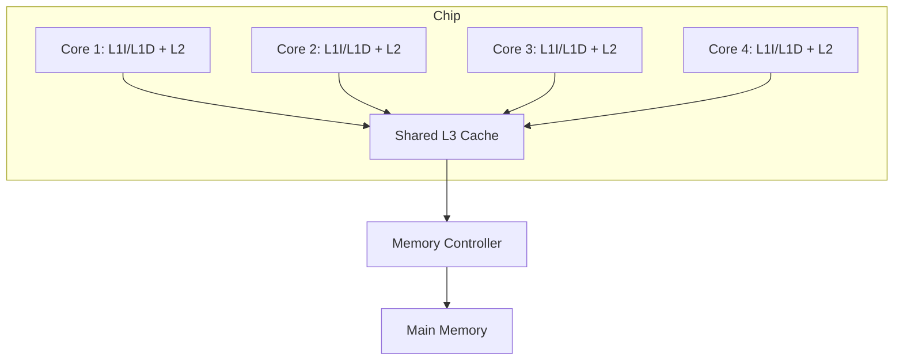
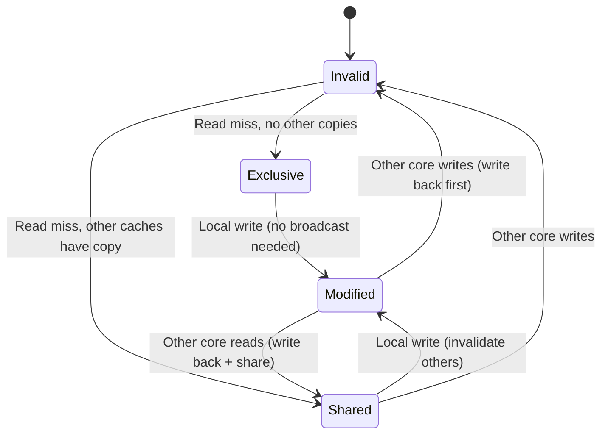

# Multicore and Multiprocessing

> [!summary] Summary
> When single-core performance hit diminishing returns from deeper pipelines and wider out-of-order execution (see [[Superscalar and Out-of-Order Execution]] §4) — largely due to power density limits (the end of Dennard scaling) — the industry pivoted to putting multiple simpler cores on one chip. This note covers multicore organization, cache coherence, and synchronization.

## 1. Why multicore instead of one faster core

Power consumption in CMOS logic scales roughly with $f \times V^2$ and clock frequency increases require higher voltage — so power grows faster than linearly with frequency. Once **Dennard scaling** broke down (~mid-2000s), designers could no longer keep raising clock speed without unmanageable heat. Since 2 cores at frequency $f$ can (for parallel workloads) roughly match the throughput of 1 core at frequency $2f$ while consuming far less power, multicore became the dominant path to more performance.

## 2. Chip Multiprocessors (CMP) organization

Each core typically has private L1 (split I/D) and L2 caches, with a larger L3 shared across all cores — see [[Memory Hierarchy]] and [[Cache Memory]].

## 3. Simultaneous Multithreading (SMT / Hyper-Threading)

A single physical core can present **multiple logical threads** by duplicating architectural state (register file, PC) while sharing execution units. Since a single thread rarely keeps every execution unit busy every cycle (see ILP limits in [[Superscalar and Out-of-Order Execution]]), interleaving a second thread's instructions can fill otherwise-idle issue slots — improving throughput, though single-thread latency isn't improved (and can even slightly regress due to resource contention).

## 4. Cache coherence

With private per-core caches, multiple cores can hold copies of the *same* memory location — a write by one core must be made visible to others to avoid incorrect results. This is the **cache coherence problem**.

### The MESI protocol

Each cache line is tagged with one of four states:

| State | Meaning |
|---|---|
| **M**odified | This cache has the only (and dirty/updated) copy; memory is stale |
| **E**xclusive | This cache has the only copy, and it matches memory (clean) |
| **S**hared | Multiple caches may hold this line, all matching memory |
| **I**nvalid | This cache's copy is not valid |

Coherence is maintained via a **bus-snooping** protocol (each cache controller watches/"snoops" all bus traffic and reacts) on smaller systems, or a **directory-based protocol** (a central or distributed directory tracks which caches hold which lines, avoiding the need to broadcast to everyone) on larger, many-core/multi-socket systems where snooping every core doesn't scale.

> [!warning] False sharing
> If two unrelated variables used by different cores happen to fall in the *same* cache line, writes to one will invalidate the other core's copy of the whole line even though the actual data they care about didn't change — a subtle, purely coherence-driven performance bug. Fixed by padding/aligning data so independently-accessed variables land on separate cache lines.

## 5. Memory consistency models

Coherence says *what* value a read eventually sees; **consistency** says *when*, relative to other memory operations, that value must become visible — i.e., what reorderings of loads/stores across different cores a programmer can rely on.
- **Sequential consistency**: the strongest, most intuitive model — all cores observe memory operations as if interleaved in *some* single global order consistent with each core's own program order. Simple to reason about but restricts hardware/compiler reordering optimizations.
- **Relaxed/weak consistency**: real CPUs (ARM, POWER) allow various reorderings for performance, requiring explicit **memory barriers/fences** in code that depends on ordering (lock acquire/release, publishing a pointer after writing its target). x86 uses a relatively strong ("TSO" - Total Store Order) model by comparison.

## 6. Synchronization primitives

- **Atomic instructions**: `test-and-set`, `compare-and-swap (CAS)`, `fetch-and-add` — hardware-guaranteed indivisible read-modify-write operations, the building blocks for locks and lock-free data structures.
- **Locks/mutexes**: built from atomics; ensure mutual exclusion over a critical section.
- **Spinlocks vs blocking locks**: spinlocks busy-wait (good for very short critical sections, avoids context-switch overhead); blocking locks yield the CPU (better when waits are long).

## See also
- [[Superscalar and Out-of-Order Execution]]
- [[Cache Memory]]
- [[Flynns Taxonomy]]
- [[GPU Architecture]]

#parallelism #multicore #cache-coherence
