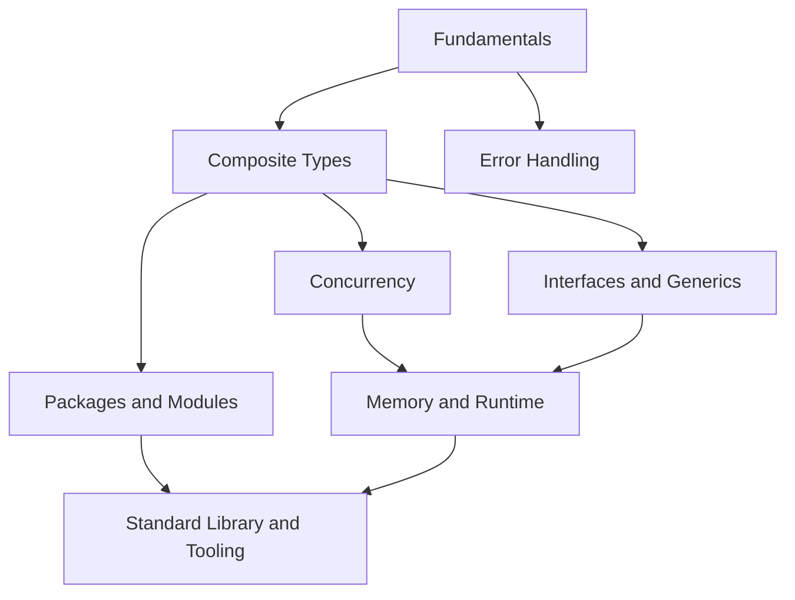

# Go — Map of Content

This is the entry point into the vault. Everything is cross-linked with `[[wikilinks]]`; use Obsidian's **Graph View** to see the whole map, or jump in through the sections below.

> [!tip] How to use this vault
> - Start at the top and work down — later notes assume earlier concepts.
> - Every note has a **Summary** callout at the top and **See also** links at the bottom.
> - Diagrams live in `attachments/` as SVG and are embedded inline.

## 1 — Fundamentals
- [[What is Go]]
- [[Go Toolchain]]
- [[Variables and Types]]
- [[Control Flow]]
- [[Functions]]

## 2 — Composite Types
- [[Arrays and Slices]]
- [[Maps]]
- [[Structs]]
- [[Pointers]]

## 3 — Concurrency
- [[Goroutines]]
- [[Channels and Select]]
- [[The sync Package]]
- [[Concurrency Patterns]]

## 4 — Interfaces and Generics
- [[Methods]]
- [[Interfaces]]
- [[Embedding]]
- [[Generics]]

## 5 — Error Handling
- [[Errors as Values]]
- [[Panic and Recover]]
- [[Error Wrapping]]

## 6 — Packages and Modules
- [[Packages and Visibility]]
- [[Go Modules]]

## 7 — Standard Library and Tooling
- [[Testing in Go]]
- [[Essential Standard Library Packages]]
- [[Go Tooling]]

## 8 — Memory and Runtime
- [[The Go Scheduler]]
- [[Garbage Collection]]
- [[Escape Analysis]]

## Reference
- [[Go Glossary]]

---

## Conceptual roadmap

## Big picture: how it all fits together

Go was designed to compile fast, run fast, and make concurrent programs easy to write correctly — all three goals show up throughout this vault. The language starts from a small set of [[Variables and Types|simple types]] and [[Control Flow|control structures]], builds up [[Arrays and Slices|composite types]] without classes or inheritance, and expresses shared behavior through structurally-satisfied [[Interfaces]] rather than explicit `implements` declarations. Its signature feature is built-in concurrency: [[Goroutines]] are cheap enough to spawn by the thousands, coordinated safely through [[Channels and Select|channels]] rather than manual locking wherever possible. Underpinning all of this is a runtime that ships inside every compiled binary — [[The Go Scheduler|a scheduler]] that multiplexes goroutines onto OS threads, and a [[Garbage Collection|garbage collector]] tuned for low pause times. [[Errors as Values|Errors are ordinary return values]], not exceptions, which is why [[Error Wrapping|wrapping and inspecting them]] is such a deliberate, visible part of everyday Go code. [[Go Modules|Modules]] and a rich [[Essential Standard Library Packages|standard library]] round out a language designed to need as few external dependencies as possible for real production software.

#moc
