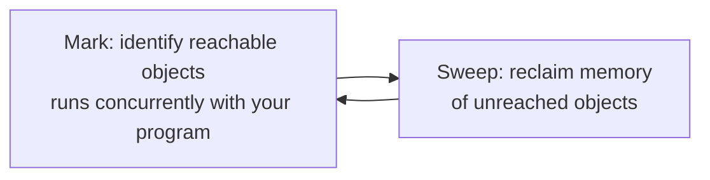

# Garbage Collection

> [!summary] Summary
> Go's garbage collector is a concurrent, tri-color mark-and-sweep collector tuned specifically to minimize **pause times** rather than maximize raw throughput — a deliberate trade-off suited to latency-sensitive network services, Go's primary use case.

## 1. Why low pause times were the priority

A server handling thousands of concurrent requests (Go's bread-and-butter use case, enabled by cheap [[Goroutines]]) is extremely sensitive to "stop the world" pauses — even a occasional 100ms freeze translates directly into a spike in tail latency across every in-flight request. Go's GC design has consistently prioritized driving worst-case pauses down (from tens of milliseconds in early versions to sub-millisecond in modern Go), even at the cost of somewhat higher CPU overhead compared to a throughput-optimized, longer-pausing collector.

## 2. Tri-color mark-and-sweep, concurrently

The collector conceptually colors every object **white** (not yet visited), **grey** (visited, but its references not yet scanned), or **black** (visited, references scanned) at the start of a GC cycle:

1. Start with all objects white, roots (globals, stack variables) marked grey.
2. Repeatedly pick a grey object, scan its references (marking anything they point to grey if still white), then mark it black.
3. Once no grey objects remain, every remaining **white** object is unreachable — garbage — and its memory is reclaimed.

Critically, this marking runs **concurrently** with the program's own goroutines actually running (not fully stopped) — a **write barrier** (a small extra check inserted around every pointer write during the concurrent marking phase) ensures the collector doesn't miss an object a running goroutine just made reachable mid-scan, preserving correctness without needing to freeze everything.



## 3. Stop-the-world pauses still happen — but are tiny

Two brief STW (stop-the-world) pauses bracket each GC cycle — one at the very start (to enable write barriers and establish roots) and one near the end (to finish marking) — but both are engineered to be extremely short (typically sub-millisecond), regardless of heap size, precisely because nearly all the actual marking work happens concurrently in between them.

## 4. GOGC — the primary tuning knob

```bash
GOGC=100   # default: trigger a GC cycle when heap has grown 100% since the last cycle
GOGC=200   # trigger less often — more memory used, less CPU spent on GC
GOGC=50    # trigger more often — less memory used, more CPU spent on GC
GOGC=off   # disable GC entirely (rarely appropriate — short-lived batch jobs, mainly)
```

`GOGC` (or `debug.SetGCPercent` at runtime) controls the trade-off directly: a higher value tolerates more memory growth between collections (less CPU overhead, more peak memory), a lower value collects more eagerly (less peak memory, more CPU overhead).

## 5. GOMEMLIMIT — a hard memory ceiling (Go 1.19+)

```bash
GOMEMLIMIT=512MiB
```

Rather than (or alongside) `GOGC`'s relative-growth trigger, `GOMEMLIMIT` sets a **soft memory cap** the runtime actively tries to stay under, collecting more aggressively as usage approaches it — particularly useful in containerized deployments with a hard memory limit, where exceeding it means an OOM-kill rather than a graceful GC response.

## 6. Reducing GC pressure in application code

> [!tip] The biggest lever is usually allocating less, not tuning the collector
> Since the collector's total work scales with how much garbage is produced, reducing unnecessary heap allocations (see [[Escape Analysis]] for what causes them) is typically far more effective than tuning `GOGC`/`GOMEMLIMIT`. Common techniques: reusing buffers via `sync.Pool`, preferring value types and avoiding unnecessary pointers where escape analysis would otherwise keep a value on the stack, and using `strings.Builder`/pre-sized slices (`make([]T, 0, n)`) to avoid repeated reallocation.

```go
var bufPool = sync.Pool{
    New: func() any { return new(bytes.Buffer) },
}

buf := bufPool.Get().(*bytes.Buffer)
defer bufPool.Put(buf)
buf.Reset()
// ... use buf ...
```

`sync.Pool` recycles temporary objects across goroutines instead of letting them become garbage and reallocating fresh ones each time — a common optimization for hot paths that repeatedly need a short-lived buffer.

## See also
- [[Escape Analysis]]
- [[The Go Scheduler]]
- [[Go Tooling]] — pprof for finding allocation hotspots

#go #runtime #garbage-collection
