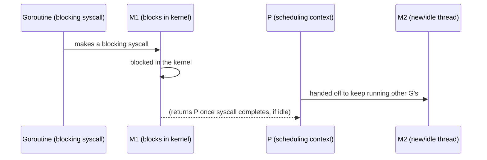

# The Go Scheduler

> [!summary] Summary
> Go's runtime includes its own scheduler that multiplexes potentially millions of [[Goroutines]] onto a much smaller number of OS threads — the **GMP model** (Goroutine, Machine, Processor) — enabling goroutines to be so cheap in the first place.

![[goroutines-scheduler-gmp.svg]]

## 1. The three abstractions

| | What it is | Roughly analogous to |
|---|---|---|
| **G** (Goroutine) | A lightweight, runtime-managed unit of concurrent execution with its own small, growable stack | A green thread / coroutine |
| **M** (Machine) | An actual OS thread | A pthread / kernel thread |
| **P** (Processor) | A scheduling context — holds a local run queue of G's ready to run, and is required for an M to execute Go code | A "permission slot" to run Go code |

The number of P's is controlled by `GOMAXPROCS` (defaulting to the number of logical CPUs) — this is the real cap on how many goroutines can run **truly in parallel** at any instant, regardless of how many goroutines or OS threads exist.

## 2. Why this indirection exists

An M cannot execute Go code without holding a P. This decoupling is what lets the scheduler handle blocking syscalls gracefully: when a goroutine makes a blocking syscall, its M blocks with it, but the **P** it was using detaches and is handed to a different M (spun up fresh, or grabbed from an idle pool) — so other goroutines assigned to that P keep running, undisturbed by the one that's blocked in the kernel. Without this P/M split, a single blocking syscall could stall an entire scheduling context's worth of ready-to-run goroutines.



## 3. Local and global run queues

Each P maintains its own **local run queue** of goroutines ready to run — keeping most scheduling decisions local (no shared-queue lock contention) is a major source of the scheduler's efficiency at high goroutine counts. A smaller **global run queue** exists as overflow, and periodically an idle P checks it (and other P's local queues, via **work stealing** — literally taking goroutines from a busy P's queue) to avoid a P sitting idle while work is available elsewhere.

## 4. Cooperative preemption and async preemption

Older Go versions relied on **cooperative** preemption: a goroutine only yielded at specific points (function calls, primarily), meaning a tight loop with no function calls could theoretically starve the scheduler indefinitely. Go 1.14+ added **asynchronous preemption**: the runtime can interrupt a running goroutine via an OS signal even mid-loop, ensuring the scheduler stays responsive even against pathological, call-free busy loops — a fix for a genuine, if rare, real-world scheduling-fairness bug class.

## 5. GOMAXPROCS in practice

```go
runtime.GOMAXPROCS(4)   // explicitly set — rarely needed, the default is almost always correct
n := runtime.NumCPU()    // number of logical CPUs visible to the process
```

> [!tip] Leave GOMAXPROCS at its default in almost all cases
> The default (matching the number of logical CPUs, and container-CPU-limit-aware since Go 1.5/automatic cgroup detection improvements in later versions) is correct for the overwhelming majority of programs. Manually lowering it can help in specific scenarios (sharing a machine with other latency-sensitive processes); manually raising it beyond the CPU count rarely helps CPU-bound work and mostly increases scheduling/context-switch overhead.

## 6. Goroutine states

A goroutine is, at any moment, one of: **running** (actively executing on some M), **runnable** (ready, waiting in a run queue for an M/P), or **waiting** (blocked on a channel operation, a syscall, a mutex, network I/O, or a timer). This state machine — invisible to the programmer writing ordinary Go code — is what the scheduler is continuously managing across every P.

## See also
- [[Goroutines]]
- [[Channels and Select]]
- [[Garbage Collection]]

#go #runtime #scheduler
