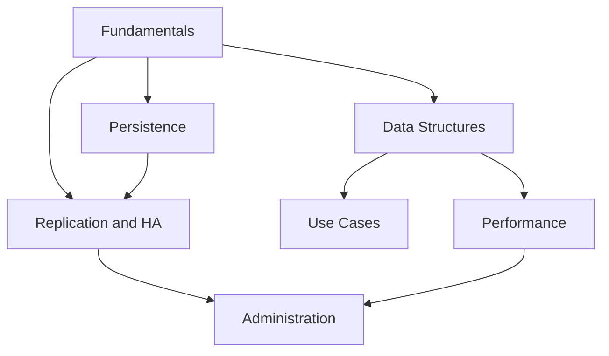

# Redis — Map of Content

This is the entry point into the vault. Everything is cross-linked with `[[wikilinks]]`; use Obsidian's **Graph View** to see the whole map, or jump in through the sections below.

> [!tip] How to use this vault
> - Start at the top and work down — later notes assume earlier concepts.
> - Every note has a **Summary** callout at the top and **See also** links at the bottom.
> - Diagrams live in `attachments/` as SVG and are embedded inline.

## 1 — Fundamentals
- [[What is Redis]]
- [[Redis Architecture and Event Loop]]
- [[RESP Protocol]]
- [[Keys and Expiry]]

## 2 — Data Structures
- [[Strings]]
- [[Lists]]
- [[Hashes]]
- [[Sets]]
- [[Sorted Sets]]
- [[Streams]]
- [[Bitmaps and HyperLogLog]]
- [[Geospatial Indexes]]

## 3 — Persistence
- [[RDB Snapshotting]]
- [[AOF Append-Only File]]
- [[Backup and Restore]]

## 4 — Replication and High Availability
- [[Replication]]
- [[Redis Sentinel]]
- [[Redis Cluster]]

## 5 — Performance
- [[Memory Optimization]]
- [[Eviction Policies]]
- [[Pipelining and Transactions]]
- [[Lua Scripting]]

## 6 — Use Cases
- [[Caching Patterns]]
- [[Pub Sub Messaging]]
- [[Rate Limiting]]
- [[Leaderboards]]
- [[Session Store]]
- [[Queues and Task Processing]]

## 7 — Administration
- [[Configuration]]
- [[Security and ACLs]]
- [[Monitoring and Observability]]

## Reference
- [[Redis Glossary]]

---

## Conceptual roadmap

## Big picture: how it all fits together

Redis is an **in-memory data structure server**: a single-threaded [[Redis Architecture and Event Loop|event loop]] executes commands from the [[RESP Protocol]] against a keyspace of typed [[Strings|values]] — [[Lists]], [[Hashes]], [[Sets]], [[Sorted Sets]], [[Streams]], and more. Durability across restarts comes from [[RDB Snapshotting]] and/or the [[AOF Append-Only File]]. Scaling beyond one node and surviving failures relies on [[Replication]], [[Redis Sentinel]] (for automatic failover), and [[Redis Cluster]] (for sharding). Getting the most out of a single instance means understanding [[Memory Optimization]], [[Eviction Policies]], and [[Pipelining and Transactions]]. All of this underpins the common [[Caching Patterns|real-world patterns]] — caching, pub/sub, rate limiting, leaderboards, session storage, and lightweight queues — that make Redis one of the most widely deployed pieces of infrastructure in modern systems.

#moc
