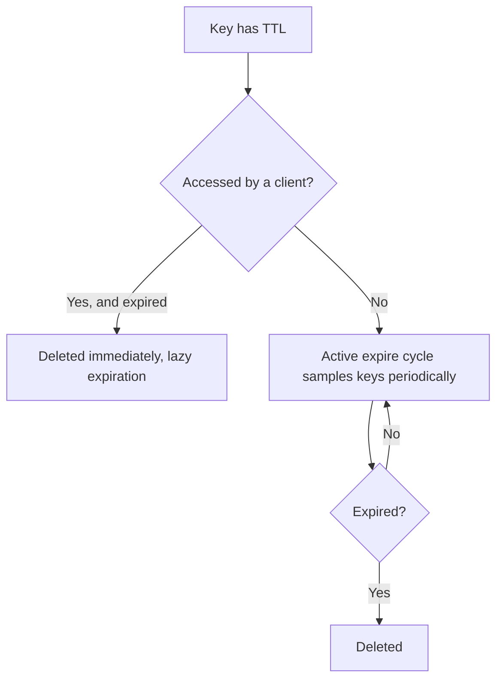

# Keys and Expiry

> [!summary] Summary
> Every Redis value is addressed by a binary-safe string **key**, optionally with a **Time To Live (TTL)** after which it's automatically removed. This note covers key design conventions, expiry mechanics, and how expiration interacts with persistence and replication.

## 1. Keys

- Keys are **binary-safe strings** — anything from a short string to a full JPEG file's bytes can technically be a key, though in practice keys are short, readable identifiers.
- There's no built-in namespace/table concept — convention fills the gap. The near-universal pattern is **colon-delimited hierarchical naming**:

```
user:1000:profile
user:1000:sessions
order:9f21:items
cache:page:/home
```

> [!tip] Key naming conventions
> - Keep keys reasonably short — every key is stored in the global hash table and consumes memory (see [[Memory Optimization]]).
> - Be consistent (`object-type:id:field`, always the same order) so patterns and `SCAN` matches stay predictable.
> - Avoid extremely dynamic/high-cardinality keys unless necessary — they inflate the hash table and prevent predictable [[Redis Cluster|cluster]] hashing patterns unless deliberately hash-tagged.

## 2. Basic key commands

| Command | Effect |
|---|---|
| `EXISTS key` | check if a key exists |
| `DEL key [key ...]` | delete key(s), synchronously freeing memory |
| `UNLINK key [key ...]` | delete key(s) asynchronously (non-blocking free) — see [[Redis Architecture and Event Loop]] |
| `TYPE key` | return the data type stored at key |
| `RENAME key newkey` | rename a key (overwrites destination) |
| `SCAN cursor` | cursor-based, non-blocking iteration over the keyspace |
| `RANDOMKEY` | return a random key |

> [!warning] KEYS vs SCAN
> `KEYS pattern` scans the *entire* keyspace in one blocking pass — on a large database this can stall the single-threaded event loop for a noticeable time, blocking every other client. `SCAN` achieves the same goal incrementally, returning a cursor to resume from, spreading the cost across many small calls instead of one large blocking one. Always prefer `SCAN` (and `HSCAN`/`SSCAN`/`ZSCAN` for large collections) in production code.

## 3. Expiry (TTL)

| Command | Effect |
|---|---|
| `EXPIRE key seconds` | set a TTL in seconds |
| `PEXPIRE key ms` | set a TTL in milliseconds |
| `EXPIREAT key unix-time` | expire at an absolute Unix timestamp |
| `TTL key` | seconds remaining (`-1` = no TTL, `-2` = key doesn't exist) |
| `PERSIST key` | remove a key's TTL, making it permanent again |
| `SET key value EX seconds` | set a value and TTL atomically in one command |

### How expiration actually happens

Redis does **not** use a per-key timer (which would be expensive at scale). Instead it combines two mechanisms:

1. **Passive (lazy) expiration**: whenever a key is accessed, Redis checks its TTL first; if expired, it's deleted on the spot before the command proceeds, as if the key never existed.
2. **Active expiration**: a background cycle runs periodically (by default ~10 times/second), sampling a small random set of keys with a TTL, deleting any that have expired, and repeating more aggressively if a large fraction of the sample was expired — ensuring expired keys are eventually reclaimed even if never accessed again.



### Expiry and persistence/replication

- On a **replica**, keys are *not* actively expired independently — a replica waits for the primary to send an explicit `DEL`/`UNLINK` for an expired key (via the replication stream), ensuring primary and replicas never disagree about whether a key still exists. Reads on a replica for a logically-expired-but-not-yet-deleted key are masked to behave as if it were already gone.
- Expired keys are **not** written into a fresh [[RDB Snapshotting|RDB snapshot]] taken after they expire.

## 4. Atomic conditional writes

Several commands let you set/act on a key only under a condition, all in a single atomic operation:

- `SET key value NX` — only set if the key does **not** already exist (classic building block for a distributed lock).
- `SET key value XX` — only set if the key **already** exists.
- `SETNX key value` — legacy equivalent of `SET ... NX`.
- `GETSET` / `SET ... GET` — atomically set a new value and return the old one.

> [!example] A minimal distributed lock
> `SET lock:resource unique-token NX EX 30`
> Acquires the lock only if unset, with the value used to verify ownership on release (delete only if the value still matches, done via a small [[Lua Scripting|Lua script]] for atomicity) and an automatic 30s expiry as a safety net against a crashed lock-holder.

## See also
- [[What is Redis]]
- [[Memory Optimization]]
- [[Rate Limiting]] — TTLs as the basis for sliding/fixed windows

#redis #keys #ttl
