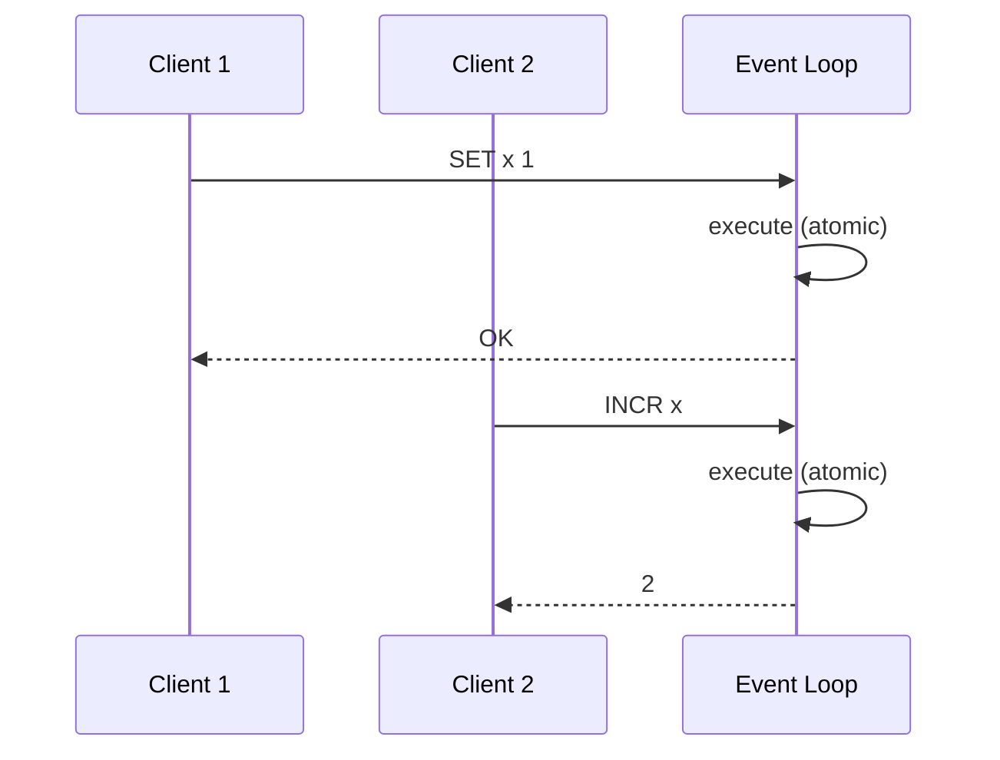

# Redis Architecture and Event Loop

> [!summary] Summary
> Redis's defining architectural choice is a **single-threaded event loop** for command execution. This note explains why that design was chosen, how it works, and where modern Redis versions have introduced limited multi-threading without abandoning the core model.

![[redis-architecture-overview.svg]]

## 1. Single-threaded command execution

All client commands are executed **one at a time**, in sequence, on a single main thread, using an event loop built on OS primitives like `epoll` (Linux), `kqueue` (BSD/macOS), or `select`/`evport` elsewhere.

Even though Redis serves potentially tens of thousands of concurrent client connections, the event loop **multiplexes** them: it waits for any socket to become readable/writable, processes whichever commands are ready, and moves on — no OS thread per connection, no context-switching overhead per client.

## 2. Why single-threaded?

- **Simplicity and correctness**: no locks, no race conditions on internal data structures. Every command (and every [[Lua Scripting|Lua script]]) executes as an atomic, indivisible unit relative to all other commands.
- **CPU is rarely the bottleneck**: most Redis operations are O(1) or O(log n) and memory-bound, not CPU-bound — the bottleneck is usually network I/O or memory bandwidth, which a single fast core handles well.
- **Predictable latency**: no lock contention or scheduler jitter from multiple threads fighting over shared structures.

> [!warning] The single-threaded trade-off
> Because everything runs on one thread, a single **slow command** (e.g., `KEYS *` on a huge keyspace, or a large `SORT`/`SMEMBERS` on a huge collection) blocks *every other client* until it finishes. This is why Redis documentation strongly discourages O(n) commands like `KEYS` in production and offers safer cursor-based alternatives (`SCAN`, `HSCAN`, `SSCAN`, `ZSCAN`) that paginate work across multiple calls instead of blocking the loop.

## 3. What is NOT single-threaded

Modern Redis (4.0+) offloads some work to background threads to avoid blocking the main loop:

- **Lazy freeing (`UNLINK`, `lazyfree-*` configs)**: deleting a very large key can be expensive (freeing millions of allocated objects) — this can be pushed to a background thread instead of blocking the main loop on `DEL`.
- **I/O threads (Redis 6+)**: reading requests from and writing replies to client sockets can be parallelized across a small pool of I/O threads, while **command execution itself remains single-threaded**. This helps when network syscall overhead — not execution — is the bottleneck on high-throughput workloads.
- **`BGSAVE` / RDB forking**: persistence snapshots run in a **forked child process** (a separate OS process, not a thread) using copy-on-write memory — see [[RDB Snapshotting]].
- **`BGREWRITEAOF`**: similarly forks a child process to rewrite the AOF file — see [[AOF Append-Only File]].

## 4. The fetch-execute-reply cycle

1. Event loop detects a readable client socket.
2. Reads and parses the command using the [[RESP Protocol]].
3. Executes the command against the in-memory dataset (a global hash table mapping keys to typed values).
4. Optionally propagates the write to the [[AOF Append-Only File|AOF]] buffer and to connected [[Replication|replicas]].
5. Writes the reply back to the client's socket buffer.
6. Loop continues to the next ready event.

## 5. Memory as the real constraint

Since Redis holds data in RAM, the practical scaling limit is usually **memory**, not CPU. This shapes several other topics in this vault:
- [[Memory Optimization]] — encoding choices that shrink memory footprint per data type.
- [[Eviction Policies]] — what happens when memory fills up.
- [[Redis Cluster]] — horizontal scaling by sharding data (and thus memory) across nodes.

## See also
- [[What is Redis]]
- [[RESP Protocol]]
- [[Pipelining and Transactions]]

#redis #architecture
