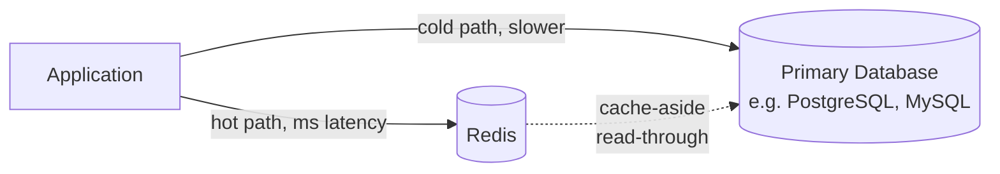

# What is Redis

> [!summary] Summary
> Redis ("REmote DIctionary Server") is an open-source, in-memory data structure store used as a database, cache, message broker, and streaming engine. Its defining traits are speed (everything lives in RAM), rich native data types (not just strings), and simplicity (a small, predictable command set).

## 1. Core identity

- **In-memory**: the entire (or working-set) dataset lives in RAM, giving sub-millisecond latency for most operations — orders of magnitude faster than disk-backed databases for the same operation.
- **Data structure server, not just a key-value store**: values aren't limited to strings/blobs — Redis natively understands [[Lists]], [[Hashes]], [[Sets]], [[Sorted Sets]], [[Streams]], and more, each with dedicated operations executed *inside* the server (e.g., incrementing a field, pushing to a list) rather than round-tripping a blob out, modifying it in the client, and writing it back.
- **Single-threaded core**: command execution happens on one thread (see [[Redis Architecture and Event Loop]]), making most operations atomic without explicit locking.
- **Persistence optional but available**: despite being in-memory, data can survive restarts via [[RDB Snapshotting]] and/or the [[AOF Append-Only File]].
- **Extensible**: supports server-side scripting ([[Lua Scripting]]), pub/sub messaging, and (via Redis Stack/modules) search, JSON, time-series, and probabilistic data types.

## 2. Where Redis fits in a system

Redis is most commonly deployed **alongside** a primary database (PostgreSQL, MySQL, MongoDB, etc.), absorbing the hottest, most latency-sensitive reads/writes, rather than replacing the primary store outright. See [[Caching Patterns]] for the standard patterns this enables.

## 3. What makes Redis different from a typical cache

| Feature | Simple cache (e.g. Memcached) | Redis |
|---|---|---|
| Data types | Blob only | Strings, Lists, Hashes, Sets, Sorted Sets, Streams, Bitmaps, HyperLogLog, Geo |
| Persistence | None | RDB and/or AOF |
| Replication / HA | None built-in | [[Replication]], [[Redis Sentinel]], [[Redis Cluster]] |
| Atomic multi-step ops | No | Yes — e.g. `ZADD` + `ZRANGE`, or full [[Lua Scripting|Lua scripts]] |
| Pub/Sub messaging | No | Yes — see [[Pub Sub Messaging]] |
| Transactions | No | `MULTI`/`EXEC` — see [[Pipelining and Transactions]] |

This is why Redis is described as a **data structure server** rather than "just a cache" — caching is one of its most popular use cases, but far from the only one.

## 4. Typical use cases at a glance

- Caching (see [[Caching Patterns]])
- Session storage (see [[Session Store]])
- Real-time leaderboards (see [[Leaderboards]])
- Rate limiting (see [[Rate Limiting]])
- Pub/sub and lightweight messaging (see [[Pub Sub Messaging]])
- Task queues (see [[Queues and Task Processing]])
- Real-time analytics counters (HyperLogLog, bitmaps — see [[Bitmaps and HyperLogLog]])

## 5. A note on history and editions

Redis was created by Salvatore Sanfilippo in 2009. As of recent years, the project's licensing has shifted (moving away from a pure BSD-style license to source-available terms for the core project under Redis Ltd.), while the **Valkey** project (a Linux Foundation fork) continues development under the original open-source license. Both remain wire-compatible with the concepts in this vault — the commands, data structures, and architecture described here apply equally to Redis and Valkey.

## See also
- [[Redis Architecture and Event Loop]]
- [[RESP Protocol]]
- [[Keys and Expiry]]

#redis #fundamentals
