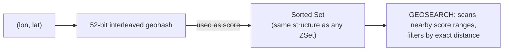

# Geospatial Indexes

> [!summary] Summary
> Redis's geospatial commands let you store coordinates (longitude/latitude) and query by proximity or distance — implemented entirely on top of [[Sorted Sets]], with no separate data type or storage engine.

## 1. Basic operations

| Command | Effect |
|---|---|
| `GEOADD key lon lat member [lon lat member ...]` | add a location |
| `GEOPOS key member [member ...]` | get coordinates back for member(s) |
| `GEODIST key m1 m2 [unit]` | distance between two members (`m`, `km`, `mi`, `ft`) |
| `GEOHASH key member` | the standard geohash string for a member |
| `GEOSEARCH key FROMMEMBER member \| FROMLONLAT lon lat BYRADIUS r unit \| BYBOX w h unit` | find members within a radius or bounding box |
| `GEOSEARCHSTORE dest key ...` | same, storing results into another key |

> [!example] "Find nearby drivers" query
> ```
> GEOADD drivers -122.42 37.77 "driver:1"
> GEOADD drivers -122.41 37.76 "driver:2"
> GEOSEARCH drivers FROMLONLAT -122.42 37.77 BYRADIUS 5 km ASC WITHCOORD WITHDIST
> ```
> Returns drivers within 5km, sorted nearest-first — a single command implementing what would otherwise require a dedicated spatial index or database extension.

## 2. How it works: geohashing on top of a Sorted Set

Each `(longitude, latitude)` pair is encoded into a single 52-bit **geohash** integer (interleaving bits of latitude and longitude to produce a value where spatially-close points tend to have numerically-close hashes), and that integer is used directly as the **score** in an ordinary [[Sorted Sets|Sorted Set]].



This is why `GEOADD`/`GEOPOS`/etc. are essentially thin wrappers: `ZSCORE` under the hood retrieves a member's geohash, and proximity search works by identifying the neighboring geohash cells (score ranges) around the query point and scanning them with the same skip-list range-query machinery covered in [[Sorted Sets]], then filtering candidates by exact great-circle distance.

> [!note] Precision
> Geohash-based indexing has inherent precision limits (~0.6m at Redis's chosen 52-bit resolution) — plenty for most location-based application use cases (ride-hailing, store locators, check-ins), not intended for high-precision geodesy or surveying.

## 3. Common use cases

- "Find nearby X" features (drivers, stores, restaurants, points of interest)
- Geofencing (checking whether a point falls within a radius of a boundary center)
- Location-based deduplication or clustering

## See also
- [[Sorted Sets]]
- [[Strings]] — the geohash itself is just an integer/score, no new storage engine involved

#redis #data-structures #geospatial
