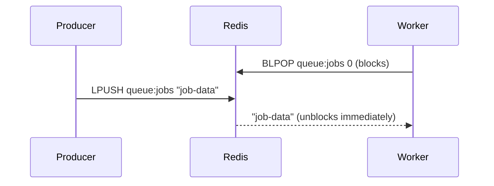

# Lists

> [!summary] Summary
> A Redis List is an ordered collection of strings, implemented internally as a **linked list of compact array chunks (quicklist)**. Lists are the natural fit for queues, stacks, recent-activity feeds, and simple message brokering.

## 1. Basic operations

| Command | Effect |
|---|---|
| `LPUSH key v1 v2 ...` | push value(s) onto the left (head) |
| `RPUSH key v1 v2 ...` | push value(s) onto the right (tail) |
| `LPOP key [count]` | pop from the left |
| `RPOP key [count]` | pop from the right |
| `LRANGE key start stop` | read a range (supports negative indices from the end) |
| `LLEN key` | length of the list |
| `LINDEX key index` | get element at index |
| `LSET key index value` | set element at index |
| `LTRIM key start stop` | trim the list to only keep a range — great for bounded recent-activity lists |
| `LREM key count value` | remove occurrences of a value |

All of these are **O(1)** for push/pop at either end, and **O(n)** for range/index operations proportional to the offset — this is why Lists are efficient as queues/stacks (ends) but not as a substitute for random-access arrays.

## 2. Lists as a queue: blocking operations

| Command | Effect |
|---|---|
| `BLPOP key [key ...] timeout` | pop from the left, **blocking** the client until an element is available or timeout elapses |
| `BRPOP key [key ...] timeout` | same, from the right |
| `LMOVE src dst LEFT\|RIGHT LEFT\|RIGHT` | atomically move an element between two lists |
| `BLMOVE ...` | blocking version of `LMOVE` |

This pattern — `LPUSH` from producers, `BRPOP`/`BLPOP` from workers — implements a simple, reliable **work queue** without any extra broker (see [[Queues and Task Processing]]). The classic reliable-queue pattern uses `LMOVE queue:jobs queue:processing` (instead of a plain pop) so an in-flight job isn't lost if a worker crashes mid-processing — it stays visible in the `processing` list until explicitly acknowledged/removed.

## 3. Internal encoding: quicklist

A List is stored as a **quicklist**: a doubly-linked list of `listpack` nodes, each node holding several elements packed contiguously. This hybrid gives:
- O(1) push/pop at either end (linked-list property)
- Good cache locality and low per-element overhead for short-to-medium values (array-packing property, avoiding a separate heap allocation per element like a pure linked list would need)

Configuration (`list-max-listpack-size`) controls how large each packed node can grow before splitting — a [[Memory Optimization]] knob.

## 4. Common use cases

- Task/job queues (see [[Queues and Task Processing]])
- Recent activity feeds ("last 100 events") via `LPUSH` + `LTRIM`
- Simple undo/redo or history stacks
- Producer-consumer pipelines between services

## See also
- [[Queues and Task Processing]]
- [[Memory Optimization]]
- [[Streams]] — a more durable, feature-rich alternative for messaging

#redis #data-structures #lists
