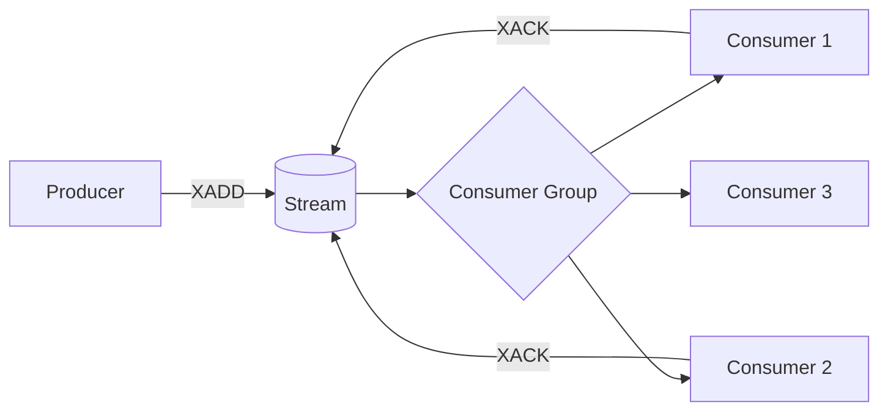

# Streams

> [!summary] Summary
> A Redis Stream is an append-only log of entries, each with a unique, time-ordered ID — modeled after log systems like Kafka. Unlike [[Pub Sub Messaging|Pub/Sub]], Streams are **persisted and replayable**, and support consumer groups for coordinated, load-balanced processing.

![[redis-data-types.svg]]

## 1. Basic operations

| Command | Effect |
|---|---|
| `XADD key * field value [field value ...]` | append an entry; `*` auto-generates an ID |
| `XLEN key` | number of entries |
| `XRANGE key start end [COUNT n]` | read entries by ID range (`-` and `+` mean "smallest"/"largest") |
| `XREVRANGE` | same, reverse order |
| `XREAD COUNT n STREAMS key id` | read entries after a given ID (non-blocking or blocking with `BLOCK ms`) |
| `XDEL key id [id ...]` | delete specific entries |
| `XTRIM key MAXLEN n` | cap the stream's length, dropping oldest entries |

### Entry IDs
Each entry's ID has the form `<millisecond-timestamp>-<sequence>`, e.g. `1700000000000-0`. IDs are strictly increasing, which is what makes range queries and "give me everything since X" semantics well-defined.

## 2. Consumer groups

The feature that most distinguishes Streams from a plain [[Lists|List]]-based queue: multiple consumers can cooperatively process a stream, each entry delivered to exactly one consumer within a group, with explicit acknowledgment.

| Command | Effect |
|---|---|
| `XGROUP CREATE key group id` | create a consumer group starting from a given ID (`$` = only new entries) |
| `XREADGROUP GROUP group consumer COUNT n STREAMS key >` | read new, undelivered entries as a named consumer |
| `XACK key group id [id ...]` | acknowledge successful processing, removing it from the group's pending list |
| `XPENDING key group` | inspect entries delivered but not yet acknowledged |
| `XCLAIM key group consumer min-idle-time id [id ...]` | reassign a stalled entry (e.g., its original consumer crashed) to another consumer |
| `XAUTOCLAIM` | a simpler, cursor-based way to auto-reassign long-pending entries |

> [!example] Why consumer groups matter for reliability
> If Consumer 1 reads an entry via `XREADGROUP` but crashes before calling `XACK`, the entry remains in the group's **Pending Entries List (PEL)** — it isn't lost, and another consumer (or the same one after restart) can `XCLAIM`/`XAUTOCLAIM` it and retry. This is fundamentally more robust than `BLPOP` on a plain List, where a crash after popping loses the item outright unless the application manually re-queues it (see the `LMOVE` pattern in [[Lists]]).

## 3. Streams vs Lists vs Pub/Sub

| | Pub/Sub | List-based queue | Stream |
|---|---|---|---|
| Persistence | None — fire and forget | Yes (it's just a key) | Yes |
| Replay old messages | No | No (popped = gone) | Yes, by ID/range |
| Multiple independent consumer groups | No (all subscribers get everything, no grouping) | No | Yes |
| Delivery acknowledgment | No | Manual (app-level) | Built-in (`XACK`, PEL) |
| Ordering | Delivery order only | FIFO | Strict ID order |

## 4. Common use cases

- Event sourcing / activity logs
- Durable job queues with retry semantics via consumer groups
- Real-time analytics pipelines (multiple consumer groups reading the same stream independently — e.g., one group indexing, another alerting)
- Change-data-capture style feeds

## See also
- [[Lists]]
- [[Pub Sub Messaging]]
- [[Queues and Task Processing]]

#redis #data-structures #streams
