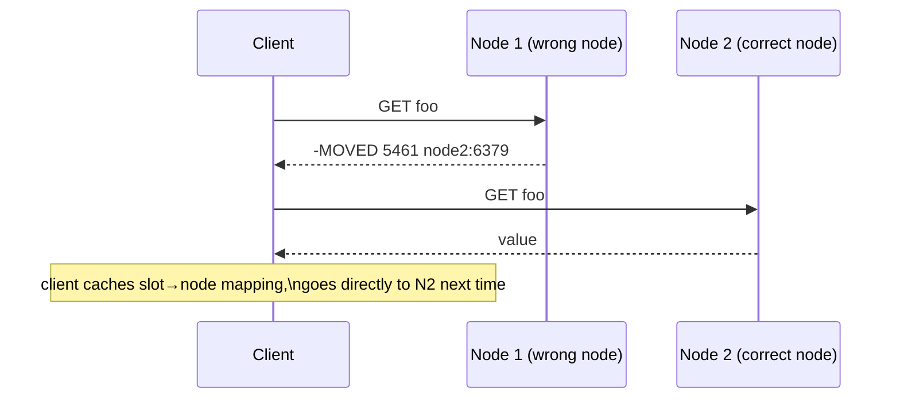

# Redis Cluster

> [!summary] Summary
> Redis Cluster shards the keyspace across multiple nodes (horizontal scaling of both memory and throughput) while also providing built-in replication and automatic failover per shard — combining what [[Replication]] + [[Redis Sentinel]] do separately into one integrated system, at the cost of some multi-key operation limitations.

![[cluster-sharding.svg]]

## 1. Hash slots

The entire keyspace is divided into **16384 fixed hash slots**. Every key is deterministically mapped to exactly one slot:

$$ \text{slot} = \text{CRC16}(\text{key}) \bmod 16384 $$

Each cluster node owns a subset of these slots (configurable, can be rebalanced live). A 3-primary cluster might split ownership roughly as 0–5460, 5461–10922, 10923–16383.

## 2. Hash tags — controlling co-location

Sometimes multiple keys need to land in the **same slot** so they can be operated on together atomically (e.g., in a transaction or multi-key command). A **hash tag** — the substring inside `{...}` in a key — forces this:

```
user:{1000}:profile
user:{1000}:sessions
```

Only the `1000` inside the braces is hashed; both keys above land in the same slot regardless of their surrounding text, letting you `MGET user:{1000}:profile user:{1000}:sessions` or wrap them in a transaction safely.

## 3. Node roles and internal replication

Each hash-slot range is owned by one **primary** node, which can have one or more **replica** nodes tracking it via the same asynchronous [[Replication]] mechanism used outside cluster mode. If a primary fails, cluster nodes run an internal, Sentinel-like agreement process (using the **gossip protocol** described below) to promote one of its replicas — no separate Sentinel deployment is needed in cluster mode.

## 4. Gossip protocol and cluster bus

Nodes continuously exchange state over a dedicated **cluster bus** (a separate TCP port, conventionally the client port + 10000), gossiping about slot ownership, node health, and configuration changes. This is how every node eventually learns the full slot-to-node mapping and detects failed peers without a centralized coordinator.

## 5. Client interaction: MOVED and ASK redirects

A client can connect to *any* cluster node and issue a command. If that node doesn't own the relevant key's slot, it doesn't proxy the request — instead it replies with a redirect:

```
-MOVED 5461 10.0.0.2:6379
```

telling the client which node actually owns that slot, so smart clients cache the full slot map (fetched via `CLUSTER SHARDS`/`CLUSTER SLOTS`) and route directly on subsequent requests, only handling `MOVED` for map updates.

An `-ASK` redirect is similar but used specifically during a **live slot migration**: it tells the client to retry against a specific node **for this one request only**, without updating its longer-term slot cache, since the slot is only mid-transfer, not yet permanently relocated.



## 6. Multi-key operation limits

> [!warning] Cross-slot operations fail
> `MGET key1 key2`, transactions, and Lua scripts touching multiple keys only work if **all** involved keys hash to the same slot. Without hash tags forcing co-location, an application that needs atomic multi-key operations across arbitrary keys must either accept the hash-tag co-location constraint or avoid Cluster mode in favor of a single large primary + [[Replication|replicas]] + [[Redis Sentinel]].

## 7. Resharding and scaling

Adding/removing nodes or rebalancing slot ownership is done live with `CLUSTER ADDSLOTS`/`CLUSTER SETSLOT`/`CLUSTER FORGET` (typically via the higher-level `redis-cli --cluster reshard` tooling), which migrates keys slot-by-slot between nodes while the cluster continues serving traffic, using `MIGRATE` to atomically move individual keys and `ASK` redirects to keep clients correctly routed mid-migration.

## 8. Cluster vs Sentinel — when to use which

| | Sentinel + single primary | Redis Cluster |
|---|---|---|
| Sharding (data > one node's RAM) | No — all data on one primary | Yes — data spread across nodes |
| Automatic failover | Yes (via Sentinel) | Yes (built-in) |
| Multi-key operations | Unrestricted | Restricted to same-slot keys (or hash tags) |
| Operational complexity | Lower | Higher (slot management, smarter clients needed) |
| Best for | Datasets that fit on one node, wanting HA | Datasets/throughput exceeding one node's capacity |

## See also
- [[Replication]]
- [[Redis Sentinel]]
- [[Memory Optimization]] — why sharding matters once a dataset outgrows single-node RAM

#redis #cluster #sharding #ha
