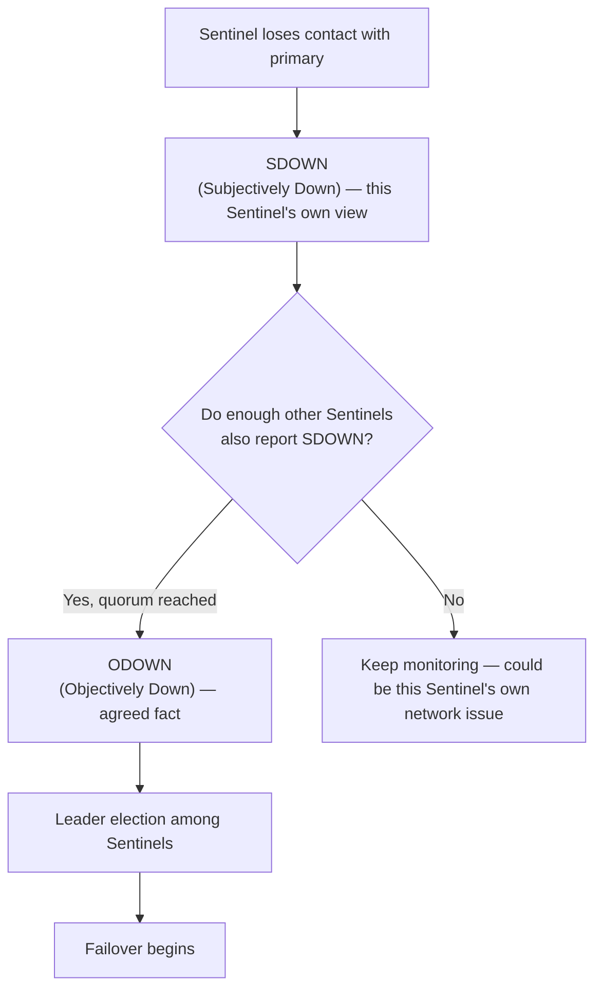

# Redis Sentinel

> [!summary] Summary
> Sentinel is a distributed monitoring and automatic-failover system that sits alongside a primary-replica [[Replication|replication]] setup. It watches instance health, agrees (via quorum) when a primary is truly down, promotes a replica, and tells clients where the new primary is — all without a separate load balancer or manual intervention.

![[sentinel-failover.svg]]

## 1. What Sentinel does

Sentinel is itself a special mode of the Redis server process, run as its own separate process(es) alongside the data nodes. Multiple Sentinel processes (conventionally 3 or 5, always an odd number for clean quorum/majority math) monitor the same primary-replica set and each other.

1. **Monitoring**: continuously PING the primary and all known replicas.
2. **Notification**: can trigger scripts/alerts on state changes.
3. **Automatic failover**: on primary failure, elects a leader Sentinel, picks the best replica, and promotes it.
4. **Configuration provider**: clients ask Sentinel "who is the current primary for master-name X?" instead of hardcoding a primary's address — this indirection is what lets clients survive a failover transparently.

## 2. Subjectively down vs objectively down

- **SDOWN**: one Sentinel's individual, unconfirmed opinion that the primary is unreachable — could just be that Sentinel's own network problem.
- **ODOWN**: enough Sentinels (the configured `quorum`) independently agree it's down — now treated as an agreed-upon fact, safe to act on.

This two-step process specifically guards against a single Sentinel's own network partition mistakenly triggering an unnecessary failover.

## 3. The failover procedure

Once ODOWN is reached:
1. Sentinels elect a **leader** among themselves (using a Raft-like majority-vote protocol) to actually drive the failover, avoiding multiple Sentinels acting independently and conflicting.
2. The leader selects the best replica to promote — prioritizing (in order) replica priority config, then replication offset (most up-to-date data), then lowest run ID as a final tiebreaker.
3. Sends `REPLICAOF NO ONE` to that replica, promoting it to primary.
4. Reconfigures all other replicas to `REPLICAOF` the newly promoted primary.
5. Updates its own records and informs subscribed clients of the new primary address (via Pub/Sub notifications and updated `SENTINEL get-master-addr-by-name`).
6. When the old primary eventually comes back online, Sentinel reconfigures it as a replica of the new primary (avoiding a split-brain where two nodes both believe they're primary).

## 4. Client interaction with Sentinel

Redis client libraries with Sentinel support don't connect directly to a hardcoded primary address. Instead:
1. Client asks any known Sentinel: `SENTINEL get-master-addr-by-name mymaster`.
2. Sentinel replies with the current primary's host/port.
3. Client connects to that address for actual commands.
4. On a connection failure, the client re-queries Sentinel to discover the (possibly new, post-failover) primary.

## 5. Quorum and split-brain considerations

> [!warning] Quorum sizing matters
> `quorum` should be set to a majority of your Sentinel count (e.g., 2 of 3) — too low a quorum risks a minority of Sentinels triggering an unnecessary failover during a partial network partition; the Sentinel *leader election* itself separately requires an actual majority of all configured Sentinels to succeed regardless of the `quorum` setting, providing a second safety layer.

Running Sentinels across multiple failure domains (different racks/availability zones) is important — if all Sentinels share the same network path as the primary, a single network event can take out the primary *and* the Sentinels' ability to reach each other, defeating the purpose of quorum-based agreement.

## See also
- [[Replication]]
- [[Redis Cluster]] — an alternative HA model with built-in sharding

#redis #sentinel #ha #failover
