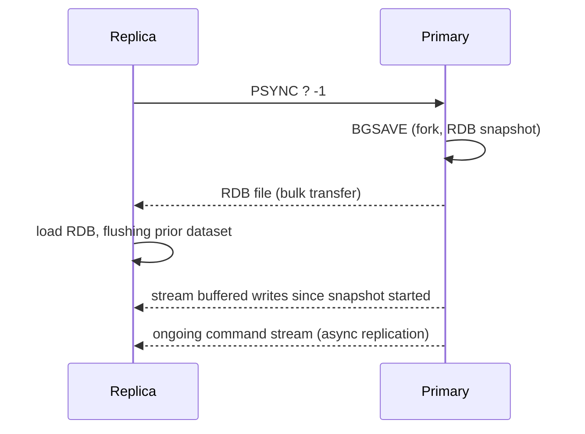
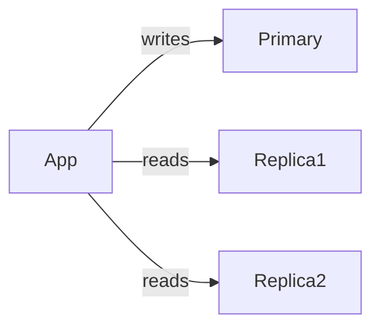

# Replication

> [!summary] Summary
> Redis replication maintains one or more read-only copies (replicas) of a primary's dataset, kept up to date via an asynchronous command stream. It underlies read scaling, backups, and (combined with [[Redis Sentinel]] or [[Redis Cluster]]) automatic failover.

![[replication-topology.svg]]

## 1. Setting up replication

A replica is pointed at a primary with one command (or config):

```
REPLICAOF <primary-host> <primary-port>
# or, in redis.conf: replicaof <primary-host> <primary-port>
```

`SLAVEOF` is the legacy alias for the same command, kept for backward compatibility.

## 2. Initial sync (full resync)

When a replica first connects (or reconnects after too long a disconnect), it performs a **full resynchronization**:



This is exactly the [[RDB Snapshotting]] mechanism reused as the bulk-transfer format for bootstrapping a replica — no separate "replication file format" exists.

## 3. Partial resynchronization

Repeating a full RDB transfer after every brief network blip would be wasteful. Redis keeps a **replication backlog** — a bounded in-memory buffer of recent write commands — and each primary/replica pair tracks a **replication offset** and a **replication ID**. If a replica reconnects and its last-known offset is still within the primary's backlog, the primary sends only the missing commands (**partial resync**, `PSYNC` with a valid offset) instead of a full RDB transfer.

`repl-backlog-size` controls how much history is retained — too small a backlog on a high-write-volume primary means brief disconnects are more likely to force an expensive full resync instead of a cheap partial one.

## 4. Asynchronous by default

Normally, the primary acknowledges a client's write **before** confirming any replica has received it — replication happens in the background. This means:
- Writes are fast (no waiting on network round-trips to replicas).
- A primary crash can lose the most recent writes that hadn't yet reached any replica.

### WAIT for semi-synchronous durability
`WAIT numreplicas timeout` blocks the calling client until at least `numreplicas` replicas have acknowledged receiving all writes issued so far (or the timeout elapses) — an opt-in way to trade latency for a stronger durability guarantee on writes that need it, without making *all* replication synchronous.

## 5. Read scaling with replicas

Since replicas are read-only by default (`replica-read-only yes`), a common pattern is to route read-heavy traffic to replicas while all writes go to the primary:



> [!warning] Replication lag and read-your-own-writes
> Because replication is asynchronous, a replica can lag behind the primary by anywhere from microseconds to (under load or network issues) seconds. An application that writes then immediately reads back from a replica can see stale data. Common mitigations: read from the primary for anything that must be immediately consistent, or track a "wrote-at" offset/timestamp and only trust a replica once it's caught up past that point.

## 6. Chained replication

Replicas can themselves have sub-replicas (`replica-of` another replica rather than the primary directly), forming a tree. This reduces load on the primary when there are many replicas, at the cost of additional replication hops (and thus additional lag) for the leaf replicas.

## 7. Replication and failover

Plain replication has **no automatic failover** — if the primary dies, a human (or external tooling) must promote a replica manually with `REPLICAOF NO ONE`. Automating this detection-and-promotion is exactly what [[Redis Sentinel]] and [[Redis Cluster]] add on top of the replication mechanism described here.

## See also
- [[Redis Sentinel]]
- [[Redis Cluster]]
- [[RDB Snapshotting]]

#redis #replication #ha
