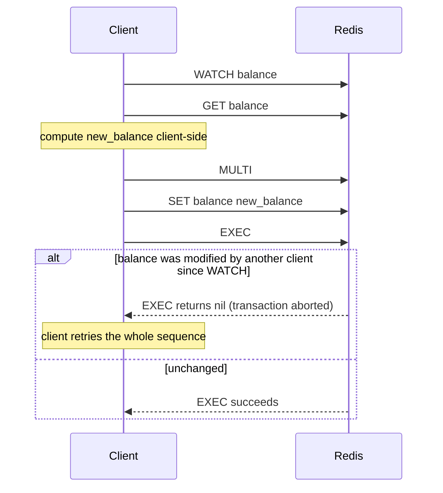

# Pipelining and Transactions

> [!summary] Summary
> Two independent techniques often confused with each other: **pipelining** reduces network round-trips (a latency optimization), while **transactions** (`MULTI`/`EXEC`) guarantee a batch of commands executes atomically with no other client's commands interleaved (an isolation guarantee). They solve different problems and can be combined.

![[transactions-pipeline.svg]]

## 1. The round-trip problem

Every command, sent and waited on individually, pays a full network round-trip time (RTT). For 1000 small commands at 1ms RTT, that's a full second spent just waiting on network latency — even though Redis itself executes each command in microseconds.

## 2. Pipelining

**Pipelining** sends multiple commands to the server without waiting for each individual reply, then reads all the replies back afterward, in order. Since the [[RESP Protocol]] is a simple stream of self-delimiting messages, this requires no special server-side support — a client just writes several encoded commands back-to-back before reading anything.

```
redis-cli --pipe < commands.txt

# or, in most client libraries:
pipe = client.pipeline()
pipe.set("a", 1)
pipe.set("b", 2)
pipe.set("c", 3)
pipe.execute()   # 1 round trip for all 3 commands
```

> [!warning] Pipelining is not atomic
> Commands from a pipeline can still be interleaved with commands from *other* clients on the server, because the server processes them as ordinary individual commands arriving on the same connection — pipelining only changes when the *client* sends/reads, not how the *server* schedules execution relative to other clients. If atomicity across the batch is required, use a transaction (below), optionally combined with pipelining for both benefits.

## 3. Transactions: MULTI / EXEC

```
MULTI
SET a 1
INCR b
LPUSH c x
EXEC
```

1. `MULTI` starts queuing — subsequent commands aren't executed immediately, just validated and queued.
2. `EXEC` executes the entire queued batch **atomically** — because Redis is single-threaded (see [[Redis Architecture and Event Loop]]), no other client's command can be interleaved between the queued commands once `EXEC` begins.
3. `DISCARD` can cancel a queued transaction before `EXEC`.

> [!note] Redis transactions don't roll back
> Unlike SQL transactions, Redis does **not** support rolling back individual failed commands within a transaction — if one command fails at runtime (e.g., wrong type for an operation), the rest of the queued commands still execute. `EXEC` only guarantees *isolation* (no interleaving) and that queued commands *all* run once started, not all-or-nothing correctness in the SQL sense. Commands with a syntax error at *queue time* do abort the whole transaction before `EXEC` even begins, but a runtime type error on one command does not stop the others.

## 4. Optimistic locking with WATCH

`WATCH key [key ...]` lets a transaction abort itself if a watched key changes between `WATCH` and `EXEC` — Redis's mechanism for **optimistic concurrency control**, useful for read-modify-write sequences that need to guard against a concurrent modification.



> [!example] Why WATCH is needed
> Without it, a `GET` then `MULTI...SET` sequence has a race: another client could modify `balance` between the `GET` and the `SET`, and the transaction would blindly overwrite it with a stale computed value. `WATCH` makes Redis detect that interference and abort instead — the classic "check-and-set" (CAS) pattern.

## 5. Lua scripting as a stronger alternative

For non-trivial read-modify-write logic, a small [[Lua Scripting|Lua script]] run via `EVAL`/`EVALSHA`/`FCALL` is often preferable to `WATCH`/`MULTI`/`EXEC`: the entire script executes as one atomic unit with no retry loop needed on the client, since there's no window for another client's command to interleave within a single script's execution — the single-threaded event loop runs an entire script (or transaction) start to finish before touching any other client's command.

## 6. Combining pipelining and transactions

A `MULTI...EXEC` block can itself be sent as one pipelined batch (`MULTI`, all queued commands, and `EXEC` all written together without waiting on intermediate replies) — getting both the round-trip savings of pipelining *and* the atomicity/isolation of a transaction in a single network exchange. Most client libraries' transaction APIs do exactly this automatically.

## See also
- [[Lua Scripting]]
- [[RESP Protocol]]
- [[Redis Architecture and Event Loop]]

#redis #performance #pipelining #transactions
