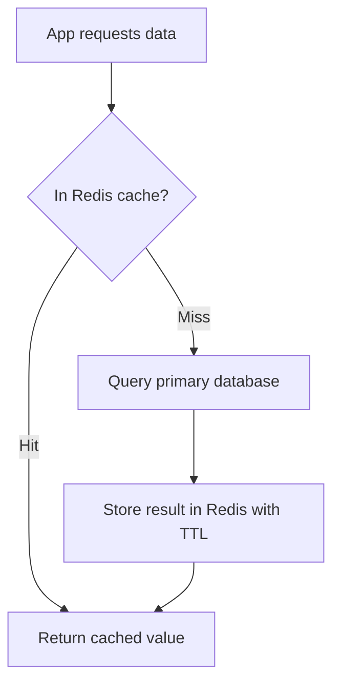

# Caching Patterns

> [!summary] Summary
> Caching is Redis's single most common use case. This note covers the standard caching strategies, their trade-offs, and the classic pitfalls (stampedes, stale reads, cache/DB inconsistency).

## 1. Cache-aside (lazy loading)

The most common pattern: the application checks the cache first, falling back to the primary database on a miss, then populates the cache for next time.



```python
value = redis.get(key)
if value is None:
    value = db.query(...)
    redis.set(key, value, ex=300)  # 5 minute TTL
return value
```

**Pros**: only requested data is ever cached (no wasted memory on unused data); cache failures degrade gracefully (just fall through to the DB).
**Cons**: every cache miss pays full DB latency; cache can go stale if the underlying data changes without an explicit invalidation.

## 2. Write-through

Writes go to the cache and the database together (typically the cache write happens as part of the same application-level write path), keeping them in sync immediately.

**Pros**: cache is never stale after a write.
**Cons**: every write pays the latency of both systems; data that's never read still occupies cache memory.

## 3. Write-behind (write-back)

Writes go to the cache immediately (fast) and are asynchronously flushed to the database later, batched.

**Pros**: very fast writes.
**Cons**: risk of data loss if Redis restarts/crashes before the async flush completes; added complexity to guarantee eventual consistency.

## 4. Cache invalidation strategies

| Strategy | How | Trade-off |
|---|---|---|
| TTL-based expiry | Set a TTL on every cached entry (see [[Keys and Expiry]]) | Simple, self-healing, but data can be stale for up to the TTL duration |
| Explicit invalidation | `DEL`/`UNLINK` the cache key when the underlying data changes | Always fresh, but requires the write path to remember every cache key that might need invalidating |
| Client-side caching (RESP3 tracking) | Server pushes invalidation messages when a tracked key changes (see [[RESP Protocol]] §3) | Near-instant invalidation with minimal round trips, but adds client complexity |

> [!tip] "There are only two hard things in computer science..."
> Combining TTL-based expiry (as a safety net/upper bound on staleness) *with* explicit invalidation on write (for the common case of prompt freshness) is the pragmatic default most systems land on — neither alone is bulletproof.

## 5. The cache stampede (thundering herd) problem

> [!warning] Cache stampede
> When a very hot key expires, many concurrent requests can simultaneously miss the cache and all hit the database at once for the same data — potentially overwhelming it. Mitigations:
> - **Probabilistic early expiration**: refresh slightly before actual TTL expiry, with a small random jitter per request, so not all clients recompute at exactly the same instant.
> - **Locking / single-flight**: the first request to miss acquires a short-lived lock (`SET lock:key 1 NX EX 5`, see [[Keys and Expiry]] §4) and repopulates the cache; other concurrent requests either wait briefly and retry the cache, or fall back to serving a slightly stale value if one exists.
> - **Never-expire + background refresh**: keep serving the (possibly slightly stale) cached value indefinitely while a background job refreshes it on a schedule, decoupling read-path latency from recomputation entirely.

## 6. Negative caching

Cache the *absence* of a result (e.g., "no user found for this ID") with a short TTL to avoid every request for a nonexistent/rare key repeatedly hitting the database — a common oversight since it's tempting to only cache successful lookups.

## See also
- [[Keys and Expiry]]
- [[Eviction Policies]]
- [[Session Store]]

#redis #use-cases #caching
