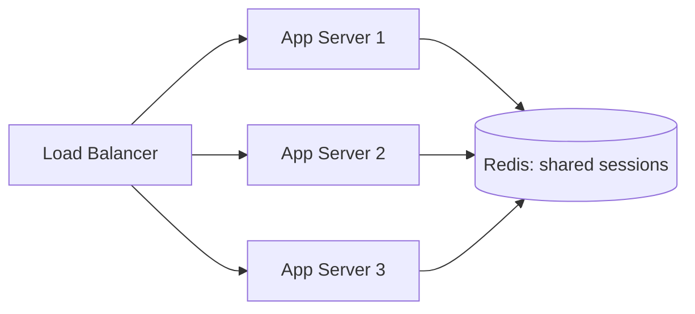

# Session Store

> [!summary] Summary
> Storing web application sessions in Redis is one of its most common uses in practice: sessions need fast reads on nearly every request, natural expiry, and — critically — a **shared** store so any server in a load-balanced fleet can serve any user's requests.

## 1. Why not just use in-process/local session storage

A naive approach keeps session data in a web server's local memory. This breaks the moment there's more than one server behind a load balancer: a user's session created on Server A is invisible to Server B, forcing either "sticky sessions" (routing a user to the same server every time — fragile, complicates deployments/scaling) or, better, a **shared external session store** — exactly what Redis provides.



## 2. Basic implementation

```
HSET session:{session_id} user_id 1000 logged_in_at 1700000000 role "admin"
EXPIRE session:{session_id} 1800   # 30-minute session timeout
```

A [[Hashes|Hash]] is the natural fit for session data — a small set of named fields per session, allowing partial updates (e.g., updating just `last_seen` without rewriting the whole session) via `HSET`.

## 3. Sliding expiration

Most session systems want the timeout to reset on activity ("logged out after 30 minutes of *inactivity*", not 30 minutes after login). This maps directly onto Redis's `EXPIRE`, reissued on every request that touches the session:

```
HGETALL session:{session_id}
EXPIRE session:{session_id} 1800   # reset the clock on every access
```

## 4. Session invalidation (logout, security events)

`DEL session:{session_id}` immediately invalidates a session — trivial compared to database-backed session stores where a similar operation might involve a slower delete/update query. This makes Redis particularly well-suited for scenarios needing instant, reliable session revocation (forced logout, "log out of all devices," suspected account compromise).

## 5. Storing multiple sessions per user

To support "log out of all other devices" or listing active sessions, maintain a [[Sets|Set]] of session IDs per user alongside the individual session hashes:

```
SADD user:{user_id}:sessions {session_id}
# to revoke all sessions for a user:
SMEMBERS user:{user_id}:sessions   →  for each: DEL session:{id}
DEL user:{user_id}:sessions
```

## 6. Sessions and high availability

Since session data is often not persisted anywhere else, losing it means forcing every active user to log in again — usually an acceptable degradation, but worth an explicit decision. Pairing the session store with [[Replication]] and [[Redis Sentinel]] (or [[Redis Cluster]] for scale) keeps sessions available through a primary failure, and enabling [[AOF Append-Only File|AOF]] persistence (`everysec`) bounds how much session data could be lost in a crash.

## See also
- [[Hashes]]
- [[Keys and Expiry]]
- [[Replication]]

#redis #use-cases #sessions
