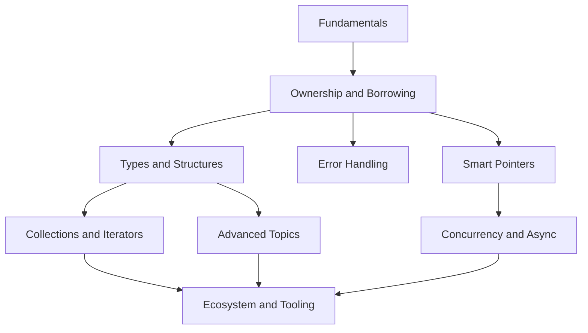

# Rust — Map of Content

This is the entry point into the vault. Everything is cross-linked with `[[wikilinks]]`; use Obsidian's **Graph View** to see the whole map, or jump in through the sections below.

> [!tip] How to use this vault
> - Start at the top and work down — later notes assume earlier concepts, especially [[Ownership]], which everything else in Rust builds on.
> - Every note has a **Summary** callout at the top and **See also** links at the bottom.
> - Diagrams live in `attachments/` as SVG and are embedded inline.

## 1 — Fundamentals
- [[What is Rust]]
- [[Cargo and the Rust Toolchain]]
- [[Variables and Mutability]]
- [[Data Types]]
- [[Functions and Control Flow]]

## 2 — Ownership and Borrowing
- [[Ownership]]
- [[References and Borrowing]]
- [[Slices]]
- [[Lifetimes]]

## 3 — Types and Structures
- [[Structs]]
- [[Enums and Pattern Matching]]
- [[Generics]]
- [[Traits]]

## 4 — Error Handling
- [[Option and Result]]
- [[Panics and Unwinding]]
- [[The Question Mark Operator]]

## 5 — Collections and Iterators
- [[Common Collections]]
- [[Iterators and Closures]]

## 6 — Concurrency and Async
- [[Threads and Message Passing]]
- [[Shared State Concurrency]]
- [[Async Await]]

## 7 — Smart Pointers
- [[Box RC and Interior Mutability]]
- [[Deref and Drop Traits]]

## 8 — Advanced Topics
- [[Trait Objects and Dynamic Dispatch]]
- [[Macros]]
- [[Unsafe Rust]]
- [[Modules and Crates]]

## 9 — Ecosystem and Tooling
- [[Testing in Rust]]
- [[Essential Crates]]

## Reference
- [[Rust Glossary]]

---

## Conceptual roadmap

## Big picture: how it all fits together

Rust's central idea is that memory safety can be checked entirely at **compile time**, with no garbage collector and no runtime overhead. That guarantee flows from a single mechanism — [[Ownership]] — enforced alongside [[References and Borrowing|borrowing]] rules and [[Lifetimes]]. Everything else in the language is built to work smoothly *with* that system: [[Structs]] and [[Enums and Pattern Matching|enums]] model data, [[Traits]] and [[Generics]] model shared behavior without inheritance, [[Option and Result|Option/Result]] model absence and failure as ordinary values instead of null pointers or exceptions, and [[Box RC and Interior Mutability|smart pointers]] provide escape hatches (heap allocation, shared ownership, interior mutability) for the cases where strict ownership alone isn't expressive enough. The same compile-time guarantees extend naturally into [[Threads and Message Passing|concurrency]] — Rust's promise of "fearless concurrency" is really just the borrow checker's rules applied across threads. [[Async Await]] builds a cooperative, non-blocking execution model on top of the same ownership foundations. All of this is packaged and distributed through [[Cargo and the Rust Toolchain|Cargo]] and the wider crates.io ecosystem.

#moc
