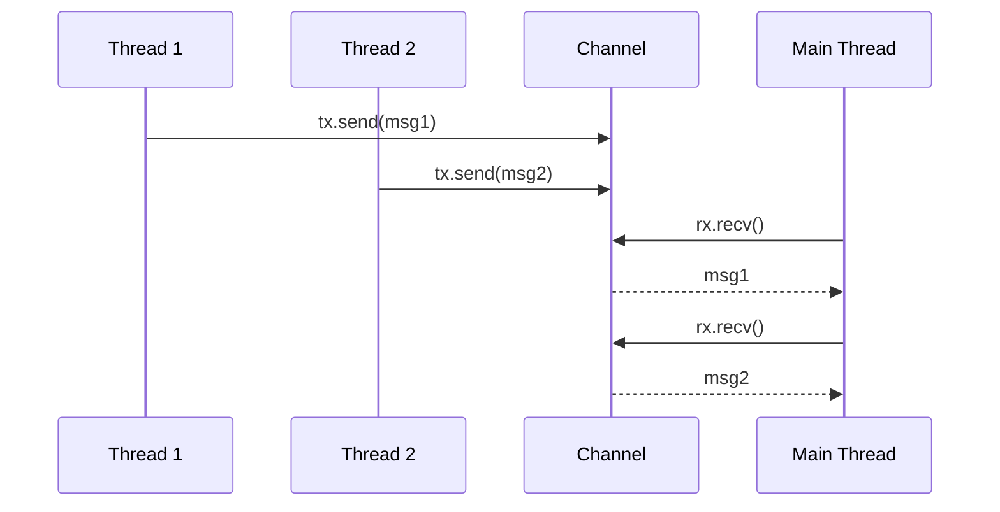

# Threads and Message Passing

> [!summary] Summary
> Rust calls its approach to concurrency "fearless concurrency": the same ownership and borrowing rules that prevent memory bugs in single-threaded code also prevent data races in multithreaded code, checked entirely at compile time. This note covers OS threads and the message-passing (channel) concurrency model.

![[concurrency-message-passing.svg]]

## 1. Spawning threads

```rust
use std::thread;

let handle = thread::spawn(|| {
    for i in 1..5 {
        println!("spawned thread: {i}");
    }
});

handle.join().unwrap();   // block the main thread until the spawned one finishes
```

Without `.join()`, the main thread might exit before the spawned thread finishes — in Rust this doesn't cause memory unsafety (unlike some other languages, since the ownership system ensures the spawned thread only holds data it's allowed to), but the spawned thread's remaining work would simply not complete, since the whole process exits when `main` returns.

## 2. move closures with threads

```rust
let data = vec![1, 2, 3];
let handle = thread::spawn(move || {   // `move` required: the closure must own `data`
    println!("{data:?}");
});
```

Without `move`, the closure would only *borrow* `data`, and the compiler can't guarantee that borrow remains valid for as long as the spawned thread might run (the spawning function could return, dropping `data`, while the thread is still using it) — so `thread::spawn` requires `'static` closures, and `move` is how you satisfy that by transferring ownership in.

## 3. Message passing with channels

```rust
use std::sync::mpsc;
use std::thread;

let (tx, rx) = mpsc::channel();

thread::spawn(move || {
    let val = String::from("hi from the spawned thread");
    tx.send(val).unwrap();
    // val is no longer usable here — it was MOVED into the channel
});

let received = rx.recv().unwrap();
println!("Got: {received}");
```

`mpsc` stands for **multiple producer, single consumer** — `tx` (the sender) can be `.clone()`d to allow many threads to send into the same channel, but there's only ever one `rx` (receiver) end.



> [!note] "Do not communicate by sharing memory; share memory by communicating."
> This is Rust's (borrowed from Go) guiding philosophy for message-passing concurrency: rather than multiple threads reading/writing the same shared memory location (requiring careful locking, see [[Shared State Concurrency]]), ownership of a value is transferred wholesale through a channel — at any instant, exactly one thread has access to it, so there's structurally nothing to race over.

### Receiving multiple values as an iterator

```rust
for received in rx {   // blocks, yielding each value as it arrives, until all senders are dropped
    println!("Got: {received}");
}
```

## 4. Send and Sync — the compiler's concurrency safety net

These two **marker traits** (traits with no methods, purely informational to the compiler) are what actually make "fearless concurrency" enforceable rather than just a design philosophy:

- **`Send`**: a type is safe to **transfer ownership of** across a thread boundary.
- **`Sync`**: a type is safe to **share a reference to** (`&T`) across threads simultaneously.

Both are auto-derived by the compiler for any type composed entirely of `Send`/`Sync` parts — you almost never implement them by hand. Their absence is what makes certain misuse a compile error rather than a runtime data race:

```rust
use std::rc::Rc;
let data = Rc::new(5);
thread::spawn(move || {
    println!("{data}");
});   // ← compile error: Rc<i32> cannot be sent between threads safely (Rc is not Send)
```

`Rc<T>` (see [[Box RC and Interior Mutability]]) uses a plain, non-atomic reference count for performance — sharing it across threads without synchronization could corrupt the count via a data race, so the compiler simply refuses to compile it, pointing you toward `Arc<T>` (atomic reference counting) instead.

## See also
- [[Shared State Concurrency]]
- [[Box RC and Interior Mutability]]
- [[Async Await]]

#rust #concurrency #threads
