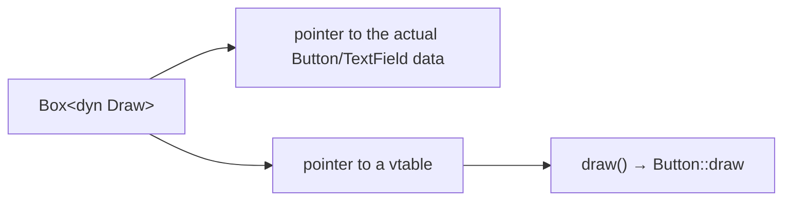

# Trait Objects and Dynamic Dispatch

> [!summary] Summary
> A trait object (`dyn Trait`) lets you store or pass around **different concrete types that share a trait**, resolved via a runtime vtable lookup instead of compile-time monomorphization (see [[Generics]] §3). This is Rust's mechanism for genuine runtime polymorphism, at the cost of a small, explicit runtime overhead.

## 1. The problem generics alone can't solve

```rust
trait Draw {
    fn draw(&self);
}

struct Button;
impl Draw for Button { fn draw(&self) { println!("drawing a button"); } }

struct TextField;
impl Draw for TextField { fn draw(&self) { println!("drawing a text field"); } }

// A single Vec that holds DIFFERENT concrete types, all implementing Draw:
let components: Vec<Box<dyn Draw>> = vec![Box::new(Button), Box::new(TextField)];
for component in &components {
    component.draw();
}
```

A generic `Vec<T: Draw>` can only ever hold **one** concrete type `T` at a time (monomorphization produces one specialized version per type — see [[Generics]]) — it fundamentally cannot mix a `Button` and a `TextField` in the same `Vec`. A trait object can, because it erases the concrete type and stores only what's needed to call trait methods on it.

## 2. How dyn Trait works: the vtable



A trait object is a **fat pointer**: two machine words instead of one — a pointer to the actual data, and a pointer to a **vtable** (virtual method table) containing function pointers for that concrete type's implementation of each trait method. Calling a method on a trait object looks up the right function through the vtable at runtime — this is **dynamic dispatch**, directly analogous to virtual method calls in C++/Java.

| | Static dispatch (generics, `impl Trait`) | Dynamic dispatch (`dyn Trait`) |
|---|---|---|
| Resolved | Compile time (monomorphization) | Runtime (vtable lookup) |
| Binary size | Larger (one copy per concrete type) | Smaller (one shared implementation) |
| Call overhead | None — direct call, can be inlined | Small — indirect call through vtable, usually not inlinable |
| Can mix multiple concrete types in one collection | No | Yes |

## 3. Where trait objects appear

```rust
fn draw_all(components: &[Box<dyn Draw>]) { ... }        // in a collection
fn make_component(kind: &str) -> Box<dyn Draw> { ... }    // as a return type when the concrete type varies by branch
struct App { component: Box<dyn Draw> }                    // as a struct field
```

`Box<dyn Trait>` is the most common form (heap-allocated, owned trait object), but `&dyn Trait` (borrowed) is also used when ownership isn't needed.

## 4. Object safety

Not every trait can become a trait object — a trait is **object-safe** only if none of its methods return `Self` (the vtable can't know the concrete return size) and none of its methods are generic (a vtable entry must be one fixed function, not a family of them). This is why, for example, `Clone` cannot be used as `dyn Clone` — `fn clone(&self) -> Self` returns `Self`, which is exactly what a trait object has already erased.

## 5. impl Trait vs dyn Trait — choosing between them

> [!tip] Default to generics/impl Trait; reach for dyn Trait when you need genuine heterogeneity
> - Use **generics** (`impl Trait`, `<T: Trait>`) when a function/struct only ever needs to work with **one** concrete type per instantiation — the common case, and it's free (static dispatch, full inlining).
> - Use **`dyn Trait`** when you specifically need to store or pass around a **mix** of different concrete types behind one shared interface at runtime (plugin systems, heterogeneous collections of UI components, callback registries) — the small dispatch overhead is the price for that flexibility.

## See also
- [[Traits]]
- [[Generics]]
- [[Box RC and Interior Mutability]]

#rust #trait-objects #dynamic-dispatch
